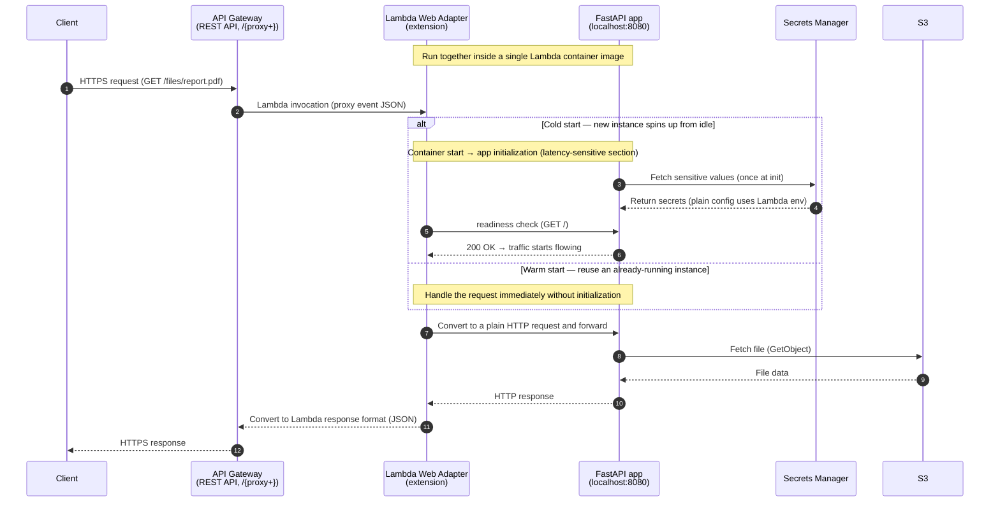

# Running a Service PoC with AWS Lambda Web Adapter + API Gateway

## Overview

I needed a simple file-serving server for a new service PoC. To keep the infrastructure burden minimal while still preserving the development experience of a typical backend framework (FastAPI), I chose to run it with the **AWS Lambda Web Adapter + API Gateway** combination.


## Problem Definition

- I needed a simple file-serving server for a new service PoC.
- Spinning up a new k8s cluster was way too heavy for a PoC, and EC2 came with plenty of its own concerns (instance selection, cost, and so on).
- AWS Lambda seemed like the right level of infrastructure, but vanilla Lambda alone still left things to be desired.
  - Building it as an API means implementing things the Lambda-function way, which differs from a typical backend server framework, making implementation and local debugging/testing cumbersome.
  - Vanilla Lambda also falls short when you want to apply slightly more complex logic or design patterns.
  - Once the PoC succeeds and becomes a real service, we'd need to move to a backend framework anyway — and migrating code from vanilla Lambda to a FastAPI project would be a hassle.

## How I Solved It

When I googled ways to run a web framework on AWS Lambda, the first thing I found was [Mangum](https://github.com/Kludex/mangum). It appeared at the top of the results and its example code was simple, so I could quickly confirm it was feasible. It actually worked quite well, so I kept developing with Mangum up through the STG deployment and integration testing.

However, during development I noticed that Mangum's official documentation page was returning a 404 Not Found. On top of that, the project hadn't been maintained for several months at the time, which made me question Mangum's long-term stability. So I looked for an alternative, and that's when I found the [AWS Lambda Web Adapter](https://github.com/awslabs/aws-lambda-web-adapter).

AWS Lambda Web Adapter is an official AWS project with the same capabilities as Mangum, so I judged it to be a suitable replacement. The migration from Mangum to AWS Lambda Web Adapter went quickly, and I was able to deploy to PRD right away.

### Why I Chose It

- **Preserves the standard backend development experience**: Build a standalone FastAPI project into an image and deploy it as-is, and the AWS Lambda Web Adapter converts API Gateway requests into HTTP requests and forwards them to the FastAPI code. There's no Lambda-specific handler code — you use a plain FastAPI app as-is, which also makes local debugging and testing easy.
- **Portability**: Because it's image-based, the same code can be reused unchanged even if we move to a k8s environment after the PoC.
- **Official AWS support**: Compared to Mangum, it's reassuring from a maintenance standpoint.


### How AWS Lambda Web Adapter Works

- An adapter written in Rust runs alongside your app as a Lambda extension, converting events from API Gateway (REST/HTTP API), ALB, or Lambda Function URLs into ordinary HTTP requests and passing them to the app.

- Attaching it is simple. For container image deployments, a single `COPY` line in the Dockerfile adds the adapter binary; for zip deployments, you can attach it as a Lambda Layer. For this project I went with the Dockerfile approach.

```dockerfile
COPY --from=public.ecr.aws/awsguru/aws-lambda-adapter:0.9.1 /lambda-adapter /opt/extensions/lambda-adapter
```

- By default the app must listen for requests on port 8080 (configurable via the `AWS_LWA_PORT` environment variable). On cold start, the readiness check (default path `/`) must pass before traffic starts flowing.

- The adapter binary just sits in `/opt/extensions`; the image's entrypoint is still the web app itself. Only the Lambda runtime executes this extension, so **the exact same image can run on local / k8s / ECS without any modification.** Or, when migrating, you only need to delete that one line adding the aws-lambda-adapter binary.

- It is **not tied to any particular language**, so beyond FastAPI you can use Flask, Express.js, Next.js, Spring Boot — anything that speaks HTTP.

### API Gateway Configuration Example

For this project I used **Lambda proxy integration (`AWS_PROXY`) without creating per-path routes in API Gateway**. I put a `/{proxy+}` catch-all resource with an `ANY` method on the REST API so that every method and path is forwarded to Lambda through a single proxy route, and let the FastAPI router handle the actual routing.

Below is a Terraform example. It assumes the Lambda function itself (the container image), the IAM role, and ECR are defined separately.

```hcl
# Container-image-based Lambda (IAM role and ECR resources omitted)
resource "aws_lambda_function" "poc" {
  function_name = "poc-file-server"
  package_type  = "Image"
  image_uri     = "${aws_ecr_repository.poc.repository_url}:latest"
  role          = aws_iam_role.lambda_exec.arn
  memory_size   = 256
  timeout       = 10
}

resource "aws_api_gateway_rest_api" "poc" {
  name = "poc-file-server"
}

# /{proxy+} : catch-all resource that receives every sub-path
resource "aws_api_gateway_resource" "proxy" {
  rest_api_id = aws_api_gateway_rest_api.poc.id
  parent_id   = aws_api_gateway_rest_api.poc.root_resource_id
  path_part   = "{proxy+}"
}

resource "aws_api_gateway_method" "proxy" {
  rest_api_id   = aws_api_gateway_rest_api.poc.id
  resource_id   = aws_api_gateway_resource.proxy.id
  http_method   = "ANY"
  authorization = "NONE"
}

# Lambda proxy integration: pass the request to Lambda as-is, without transformation
resource "aws_api_gateway_integration" "proxy" {
  rest_api_id             = aws_api_gateway_rest_api.poc.id
  resource_id             = aws_api_gateway_resource.proxy.id
  http_method             = aws_api_gateway_method.proxy.http_method
  type                    = "AWS_PROXY"
  integration_http_method = "POST" # Lambda invocations are always POST
  uri                     = aws_lambda_function.poc.invoke_arn
}

# {proxy+} does not match the root (/), so configure the same integration on the root as well
resource "aws_api_gateway_method" "root" {
  rest_api_id   = aws_api_gateway_rest_api.poc.id
  resource_id   = aws_api_gateway_rest_api.poc.root_resource_id
  http_method   = "ANY"
  authorization = "NONE"
}

resource "aws_api_gateway_integration" "root" {
  rest_api_id             = aws_api_gateway_rest_api.poc.id
  resource_id             = aws_api_gateway_rest_api.poc.root_resource_id
  http_method             = aws_api_gateway_method.root.http_method
  type                    = "AWS_PROXY"
  integration_http_method = "POST"
  uri                     = aws_lambda_function.poc.invoke_arn
}

# Trigger a redeployment whenever the integrations change
resource "aws_api_gateway_deployment" "poc" {
  rest_api_id = aws_api_gateway_rest_api.poc.id

  triggers = {
    redeployment = sha1(jsonencode([
      aws_api_gateway_integration.proxy.id,
      aws_api_gateway_integration.root.id,
    ]))
  }

  lifecycle {
    create_before_destroy = true
  }

  depends_on = [
    aws_api_gateway_integration.proxy,
    aws_api_gateway_integration.root,
  ]
}

resource "aws_api_gateway_stage" "poc" {
  rest_api_id   = aws_api_gateway_rest_api.poc.id
  deployment_id = aws_api_gateway_deployment.poc.id
  stage_name    = "poc"
}

# Grant API Gateway permission to invoke the Lambda
resource "aws_lambda_permission" "apigw" {
  statement_id  = "AllowAPIGatewayInvoke"
  action        = "lambda:InvokeFunction"
  function_name = aws_lambda_function.poc.function_name
  principal     = "apigateway.amazonaws.com"
  source_arn    = "${aws_api_gateway_rest_api.poc.execution_arn}/*/*"
}

output "api_url" {
  value = aws_api_gateway_stage.poc.invoke_url
}
```

## Final Architecture

- I built the FastAPI project into an image, deployed it to Lambda, and ran the PoC server with API Gateway in front.
- For environment variables I used env vars applied directly to the Lambda, and for sensitive values I used Secrets Manager.
- Since the deployment is image-based, there is no migration burden when we move to a k8s environment for the full-scale service later.



## Retrospective and Additional Considerations
- When a call comes in after a long period of no API traffic, AWS Lambda goes through a cold start, and in those cases the client sometimes waited so long for a response that it treated the request as a timeout. To prevent this I used [Lambda provisioned concurrency](https://docs.aws.amazon.com/lambda/latest/dg/provisioned-concurrency.html). For this project, PRD keeps up to 80 Lambda instances warm at all times.
- For a deployment strategy you could also use [weighted aliases](https://docs.aws.amazon.com/lambda/latest/dg/configuring-alias-routing.html). But I felt the changes were sufficiently validated in DEV / STG, so I didn't use them.
- For monitoring, I standardized the log format inside the FastAPI application code and used Elasticsearch; for alerting, I used CloudWatch + SNS.
