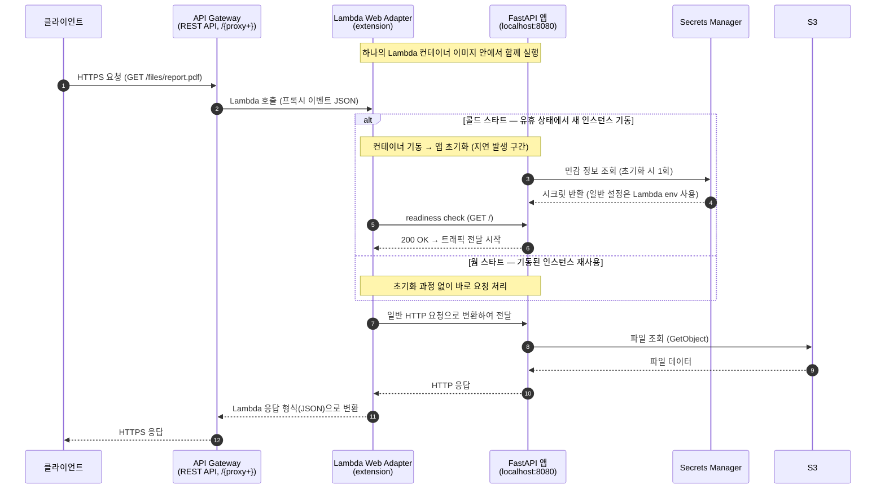

# 서비스 PoC를 위한 AWS Lambda Web Adapter + API Gateway 조합 운영

## 개요

새로운 서비스 PoC를 위해 단순 파일 제공 서버가 필요했다. 인프라 부담을 최소화하면서도, 일반적인 백엔드 프레임워크(FastAPI) 개발 경험을 유지하기 위해 **AWS Lambda Web Adapter + API Gateway** 조합을 선택하여 운영했다.


## 문제 정의

- 새로운 서비스 PoC를 위한 단순 파일 제공 서버가 필요했다.
- 새로운 k8s 클러스터 생성은 PoC 용도로는 너무 무겁고, EC2도 신경쓸 게 많았다 (인스턴스 선택, 비용 등).
- AWS Lambda 수준이 적절해 보였지만, 바닐라 Lambda만으로는 여전히 아쉬운 점이 있었다.
  - API로 구성하려면 일반적인 백엔드 서버 프레임워크와는 다른 Lambda 함수 방식으로 구현해야 해서, 구현과 로컬 디버깅/테스트가 번거롭다.
  - 조금 더 복잡한 로직이나 디자인 패턴을 적용하기에도 바닐라 Lambda 만으로는 아쉽다.
  - PoC가 완료되어 본격적인 서비스가 되면 백엔드 프레임워크로 옮겨야할텐데, 바닐라 Lambda -> FastAPI 프레임워크로의 코드 이관이 번거로워진다.

## 해결 과정

AWS Lambda에서 web framework를 실행할 수 있는 방법을 구글링했을 때 처음에 찾은 것은 [Mangum](https://github.com/Kludex/mangum)이었다. 맨 위에 노출되었으며 예시 코드가 단순했기 때문에 구현 가능성도 금방 확인할 수 있었다. 실제로 곧잘 동작했기 때문에 STG환경 배포 및 연동 테스트까지는 Mangum으로 개발을 진행하였다.

그러나 개발 도중 Mangum의 공식 문서 페이지가 404 Not found가 뜨는걸 목격했다. 게다가 그 당시에는 몇 개월째 유지보수가 이뤄지지 않던 상황이었기 때문에 Mangum의 안정성에 의문을 느끼게 되었고 대안을 찾았는데 그것이 바로 [AWS Lambda Web Adapter](https://github.com/awslabs/aws-lambda-web-adapter)이다.

AWS Lambda Web Adapter는 AWS 공식 프로젝트로 Mangum과 동일한 기능을 가지고 있었으며 대체제로 적합하다고 판단되었다. Mangum -> AWS Lambda Web Adapter로의 이전은 금방 진행되었고 곧장 PRD 레벨로도 배포할 수 있었다.

### 선택한 이유

- **일반적인 백엔드 개발 경험 유지**: 독립적으로 실행 가능한 FastAPI 프로젝트를 이미지로 그대로 빌드하여 배포하면, AWS Lambda Web Adapter가 API Gateway의 요청을 HTTP 요청으로 변환하여 FastAPI 코드에 전달해준다. Lambda 전용 핸들러 코드 없이 평범한 FastAPI 앱을 그대로 쓸 수 있어 로컬 디버깅/테스트도 수월하다.
- **이식성**: 이미지 기반이기 때문에 PoC 이후 k8s 환경으로 옮겨가더라도 코드를 그대로 사용할 수 있다.
- **AWS 공식 지원**: Mangum 대비 유지보수 측면에서 안심할 수 있다.


### AWS Lambda Web Adapter 동작 방식

- Rust로 작성된 어댑터가 Lambda 확장(extension)으로 함께 실행되면서, API Gateway(REST/HTTP API) / ALB / Lambda Function URL의 이벤트를 일반 HTTP 요청으로 변환해 앱에 전달한다.

- 붙이는 방법은 간단하다. 컨테이너 이미지 배포라면 Dockerfile에 `COPY` 한 줄로 어댑터 바이너리를 추가하면 되고, zip 배포라면 Lambda Layer로 붙일 수도 있다. 이번 프로젝트에서는 Dockerfile 형태로 진행하였다.

```dockerfile
COPY --from=public.ecr.aws/awsguru/aws-lambda-adapter:0.9.1 /lambda-adapter /opt/extensions/lambda-adapter
```

- 앱은 기본적으로 8080 포트에서 요청을 수신해야 한다(`AWS_LWA_PORT` 환경변수로 변경 가능). 콜드 스타트 시 readiness check(기본 경로 `/`)가 통과해야 트래픽이 전달이 시작된다..

- 어댑터 바이너리는 `/opt/extensions`에 놓일 뿐이고 이미지의 entrypoint는 여전히 웹 앱 그 자체다. Lambda 런타임만이 이 확장을 실행하므로, **동일한 이미지를 로컬 / k8s / ECS에서 아무 수정 없이 그대로 실행할 수 있다.** 또는 이관시 위 aws-lambda-adapter 어댑터 바이너리 추가 코드만 지우면 된다.

- **특정 언어에 종속되지 않아** FastAPI 외에도 Flask, Express.js, Next.js, Spring Boot 등 HTTP를 말하는 프레임워크라면 무엇이든 쓸 수 있다. 

### API Gateway 설정 예시

이번 프로젝트는 **Lambda 프록시 통합(`AWS_PROXY`)을 통해 API Gateway에 경로별 라우트를 만들지 않는 방식**으로 진행하였다. REST API에 `/{proxy+}` 캐치올 리소스와 `ANY` 메서드를 두어 모든 메서드/경로를 프록시 라우트 하나로 Lambda에 넘기고, 실제 라우팅은 FastAPI 라우터가 담당하도록 했다.

아래는 terraform 예시이다. Lambda 함수 자체(컨테이너 이미지)와 IAM 역할, ECR은 별도로 정의되어 있다고 가정한다.

```hcl
# 컨테이너 이미지 기반 Lambda (IAM 역할·ECR 리소스는 생략)
resource "aws_lambda_function" "poc" {
  function_name = "poc-file-server"
  package_type  = "Image"
  image_uri     = "${aws_ecr_repository.poc.repository_url}:latest"
  role          = aws_iam_role.lambda_exec.arn
  memory_size   = 256
  timeout       = 10
}

resource "aws_api_gateway_rest_api" "poc" {
  name = "poc-file-server"
}

# /{proxy+} : 모든 하위 경로를 받는 캐치올 리소스
resource "aws_api_gateway_resource" "proxy" {
  rest_api_id = aws_api_gateway_rest_api.poc.id
  parent_id   = aws_api_gateway_rest_api.poc.root_resource_id
  path_part   = "{proxy+}"
}

resource "aws_api_gateway_method" "proxy" {
  rest_api_id   = aws_api_gateway_rest_api.poc.id
  resource_id   = aws_api_gateway_resource.proxy.id
  http_method   = "ANY"
  authorization = "NONE"
}

# Lambda 프록시 통합: 요청을 변환 없이 그대로 Lambda에 전달
resource "aws_api_gateway_integration" "proxy" {
  rest_api_id             = aws_api_gateway_rest_api.poc.id
  resource_id             = aws_api_gateway_resource.proxy.id
  http_method             = aws_api_gateway_method.proxy.http_method
  type                    = "AWS_PROXY"
  integration_http_method = "POST" # Lambda 호출은 항상 POST
  uri                     = aws_lambda_function.poc.invoke_arn
}

# {proxy+}는 루트(/)를 매칭하지 않으므로 루트에도 동일한 통합 구성
resource "aws_api_gateway_method" "root" {
  rest_api_id   = aws_api_gateway_rest_api.poc.id
  resource_id   = aws_api_gateway_rest_api.poc.root_resource_id
  http_method   = "ANY"
  authorization = "NONE"
}

resource "aws_api_gateway_integration" "root" {
  rest_api_id             = aws_api_gateway_rest_api.poc.id
  resource_id             = aws_api_gateway_rest_api.poc.root_resource_id
  http_method             = aws_api_gateway_method.root.http_method
  type                    = "AWS_PROXY"
  integration_http_method = "POST"
  uri                     = aws_lambda_function.poc.invoke_arn
}

# 통합 변경 시 재배포되도록 트리거 구성
resource "aws_api_gateway_deployment" "poc" {
  rest_api_id = aws_api_gateway_rest_api.poc.id

  triggers = {
    redeployment = sha1(jsonencode([
      aws_api_gateway_integration.proxy.id,
      aws_api_gateway_integration.root.id,
    ]))
  }

  lifecycle {
    create_before_destroy = true
  }

  depends_on = [
    aws_api_gateway_integration.proxy,
    aws_api_gateway_integration.root,
  ]
}

resource "aws_api_gateway_stage" "poc" {
  rest_api_id   = aws_api_gateway_rest_api.poc.id
  deployment_id = aws_api_gateway_deployment.poc.id
  stage_name    = "poc"
}

# API Gateway가 Lambda를 호출할 수 있도록 권한 부여
resource "aws_lambda_permission" "apigw" {
  statement_id  = "AllowAPIGatewayInvoke"
  action        = "lambda:InvokeFunction"
  function_name = aws_lambda_function.poc.function_name
  principal     = "apigateway.amazonaws.com"
  source_arn    = "${aws_api_gateway_rest_api.poc.execution_arn}/*/*"
}

output "api_url" {
  value = aws_api_gateway_stage.poc.invoke_url
}
```

## 최종 구조

- FastAPI 프로젝트를 이미지로 빌드해 Lambda에 배포하고, API Gateway를 앞단에 두는 구성으로 PoC 서버를 운영했다.
- 환경변수는 Lambda에 직접 적용하는 env를 활용하고, 민감 정보는 Secrets Manager를 사용했다.
- 이미지 기반 배포라 추후 본격 서비스 전환 시 k8s 환경으로의 이관 부담이 없다.



## 회고 및 추가 고려사항
- 오랫동안 API 호출이 없다가 호출이 생기는 경우, AWS Lambda의 콜드스타트가 이뤄지는데 이 때는 클라이언트가 응답을 받기까지 꽤 오래 걸렸고 클라이언트측이 timeout으로 판단하는 경우가 생겼다. 이를 방지하기 위해 [Lambda 동시성 설정](https://docs.aws.amazon.com/lambda/latest/dg/provisioned-concurrency.html)을 활용하였다. 현 프로젝트의 경우 PRD에는 최대 80개의 lambda 인스턴스가 상시 떠있다.
- 배포 전략을 위해서는 [가중치 별칭](https://docs.aws.amazon.com/lambda/latest/dg/configuring-alias-routing.html)을 사용할 수도 있다. 그러나 나는 DEV / STG에서 충분히 검증하였다고 생각하여 사용하지 않았다.
- 모니터링의 경우 FastAPI 어플리케이션 코드 내에서 로그 포멧 표준화를 진행한 후 Elasticsearch를 활용하였고, 알람의 경우 Cloudwatch + SNS를 사용하였다.