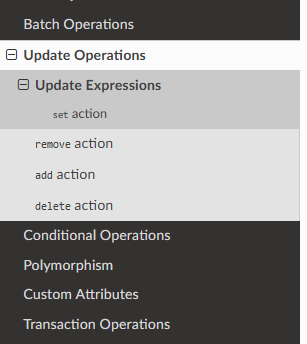
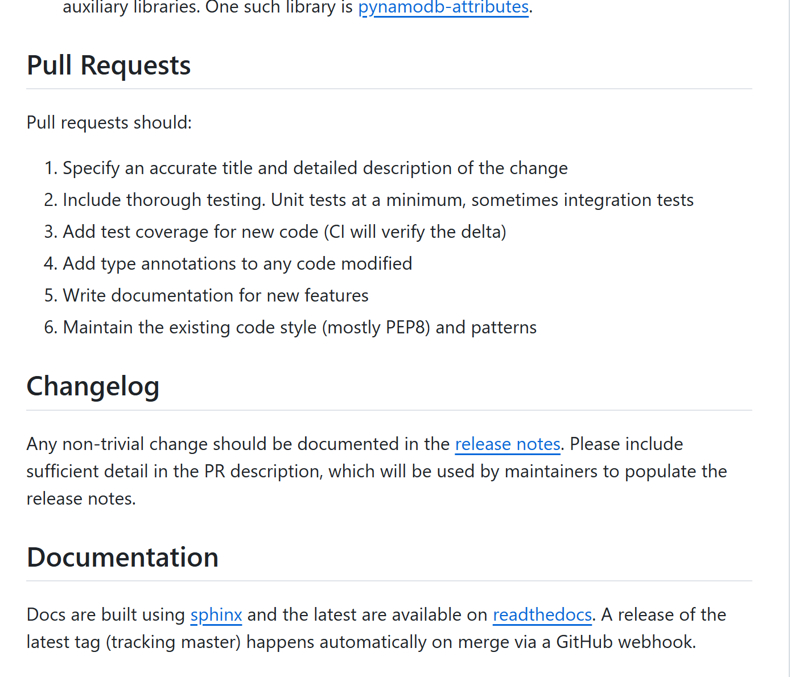
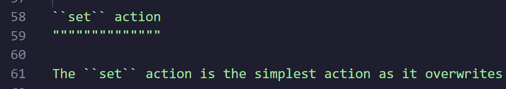
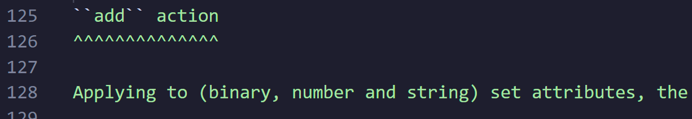
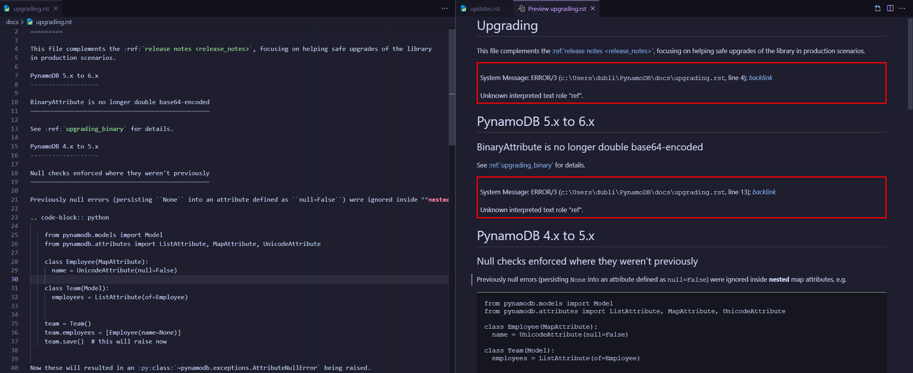
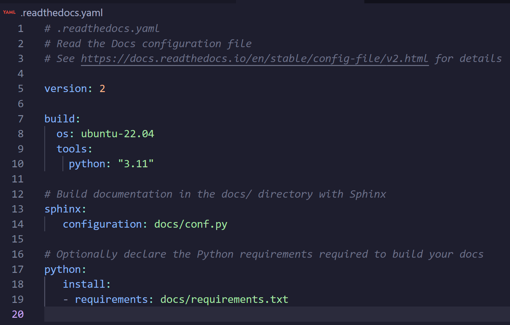
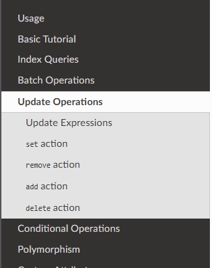
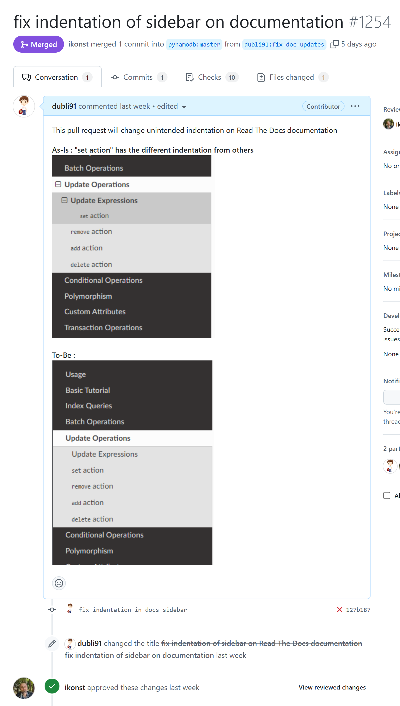
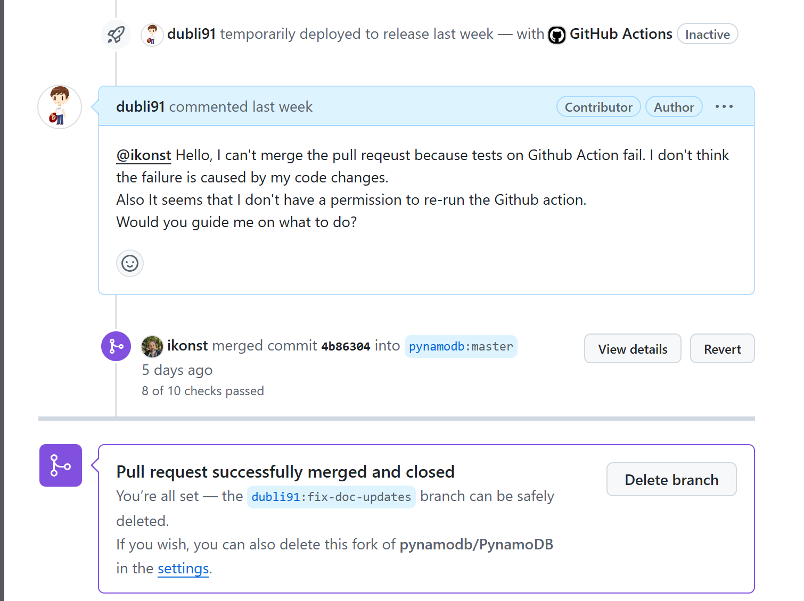
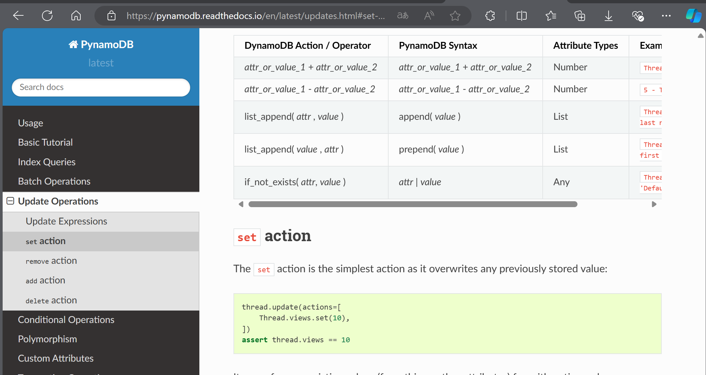

# Becoming an Open Source Contributor with a One-Line Documentation Fix

This post is a write-up of my first open source contribution!

## 0. What Is Open Source Contributing?

I asked Perplexity, the generative search engine that's all the rage these days.

> Open source contributing refers to any activity in which you participate in and contribute to an open source project. Its main characteristics and types are as follows:
> - Definition of contributing
>   - Any form of participation that contributes to the advancement of an open source project
>   - Includes not only writing code but also various non-coding activities
>
> Open source contributions can be broadly divided into coding contributions and non-coding contributions. The main types are as follows:
> - Coding contributions
>   - Writing new code: adding new features or improving existing ones
>   - Bug fixes: diagnosing and resolving problems
>   - Code refactoring: improving code structure
>   - API design and maintenance
>   - Performance optimization
>   - Writing test code: unit tests, integration tests, etc.
>
> - Non-coding contributions
>   - Documentation: writing user manuals, API docs, tutorials
>   - Translation and localization
>   - Design: logos, icons, UI/UX design
>   - Bug triage: reporting and categorizing bugs
>   - Community management: organizing events, supporting users
>   - Marketing and promotion: managing social media, writing technical articles
>   - Quality assurance and testing
>   - Security-related activities
>   - Website development and maintenance
>   - Legal advice and financial management
> 
> These diverse types of contributions reflect the overall health and maturity of an open source project, and provide pathways for people with expertise beyond coding skills to participate in projects.

In this post, I'll share my experience making a non-coding contribution.

## 1. Deciding to Fix Open Source Documentation Myself
At work I happily use PynamoDB, a library that lets you use DynamoDB like an ORM, and for a few months there had been one thing in the official documentation that kept bugging me. It was the table of contents section below — for some reason, only the "set action" entry was indented. No matter how I looked at it, it seemed like it should be at the same level as the other actions.

[No matter how you look at it, that set action is bothersome]

I'd been watching it for months and it hadn't changed, and it also seemed like the fix would be surprisingly small, so I decided to try fixing it myself.

## 2. Looking Up the Contributing Rules
First, I went to the PynamoDB GitHub repo to check whether there were any contributing rules.

There was a file called docs/contributing.rst, and it turned out to be simple: fork the master branch, make your changes, and open a pull request. Of course you have to pass the tests and write additional documentation when needed, but since I was just fixing a typo-level issue in the official docs, that didn't really apply to me.

(Tests and doc updates to match code changes — of course!)

## 3. Forking and Getting Down to the Fix
First I forked the master branch into my own GitHub repository, then created a branch locally for the documentation fix. There didn't seem to be any branch naming convention, so I just named it whatever read well to me. (dubli91:fix-doc-updates)

Digging through the code, the file that needed fixing was docs/updates.rst. It was my first time handling an rst file, so I looked it up — it stands for reStructuredText, a technical documentation file format used mainly in Python.
I couldn't bring myself to study rst syntax from scratch, so I compared the "set action" entry with the other action entries in the document, and the problem turned out to be surprisingly easy to spot.

The set action has """" underneath it, as shown above,

while the other actions have ^^^^ underneath.

I changed the """""""""""""" under "set action" to ^^^^^^^^^^^^^^ to match the other actions.
(As it turns out, in rst files " denotes a lower section level than ^)

## 4. Running the Tests
Now I had to test whether it actually worked, and this is where things took a while. I didn't know how the official PynamoDB documentation gets built.

The first thing I tried was an rst viewer plugin for VS Code. But the moment I saw the preview in the plugin, I realized something was off.

[Where did the sidebar go?..]

Digging further into the forked PynamoDB code, I found a file called .readthedocs.yaml that describes how the docs are built.

Now what on earth is Sphinx? I asked ChatGPT.

> Sphinx is a powerful documentation tool written in Python, used primarily to automatically generate documentation for software projects. Sphinx is especially popular for Python projects, but it is a general-purpose tool that can be used for non-Python projects as well. Sphinx supports multiple output formats such as HTML, PDF, and ePub, using a variety of source file formats.

I also asked ChatGPT how to build the docs, and after following along, an html folder appeared. Opening it in Chrome, I confirmed the fix worked correctly!

## 5. Opening the Pull Request
The fix was done and the tests were done, so time to open a pull request!

It got approved right away. But how does the merge happen? On top of that, some of the tests running on GitHub Actions had failed. But mine was a simple documentation fix, and what failed were Python tests — not my fault.

Just in case, I left a comment as shown below, and the reviewer apparently figured it wouldn't be a problem either, because they merged it right away.

Yeehaw!

Now I go back to the official documentation. Switch the docs version from stable to latest, and there's my fix, live!

[Applied!]

## 6. Takeaways

- Open source contributing was surprisingly easy!
  - Even without understanding the entire project codebase right away, non-coding contributions were easily approachable even for a beginner like me
  - Granted, PynamoDB's contributing rules were maybe a little too easy
- It feels great!
  - Great for bragging to people around me
  - I should do this often from now on
