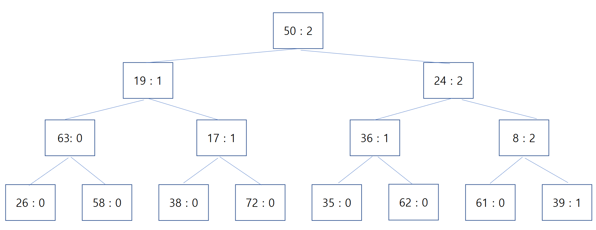
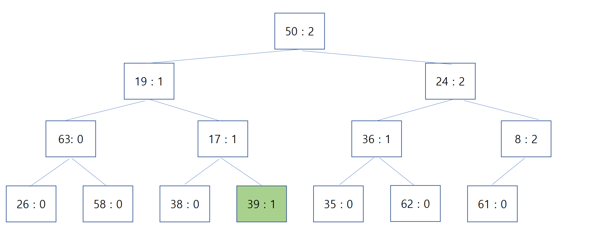
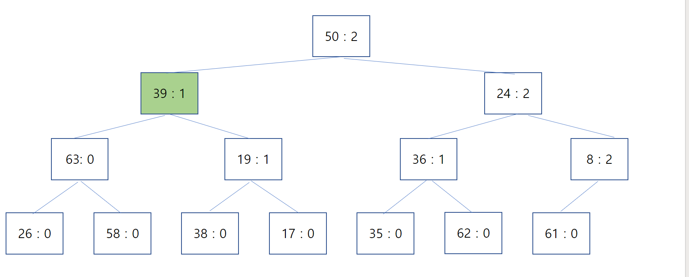

# Removing a Middle Element from a Heap

Lately I've had a reason to study for the Samsung Electronics SW Competency Test, Level B. (https://swexpertacademy.com/main/sst/intro.do) The test you take when joining Samsung through the entry-level recruitment process is Level A; after joining, people go on to Level B, and the more ambitious ones push all the way to Level C.

The current trend in the Level B test is indexing (Trie or Hashing) + priority-based search (Heap, etc.). When you think of priorities, a Heap is the first thing that comes to mind, but since the SW Competency Test makes you implement data structures by hand, I had been avoiding Heaps because of the hassle.

But eventually I ended up having to implement a Heap anyway. I couldn't remember the code well, so I grabbed some example code from the internet — and that code failed to maintain the priority order correctly through repeated deletions and insertions, costing me over six hours of debugging. It turned out there were two causes: the over-simplicity of the example code, plus my own shaky understanding of the Heapify operation. So I figured this was a good opportunity to write it all down.

 

## What Is a Heap?

A Heap is a kind of complete binary tree, a data structure used to implement priority queues. It guarantees that the root node has the highest priority, but the elements are not fully sorted. The following property does hold, though.

> If A is the parent node of B, then an ordering relationship holds between the key of A and the key of B. 

## What Is Heapify?

Heapify is the operation of rearranging the elements in a Heap so that the property above holds again after inserting or removing an element. Most example code puts this work into a function called Heapify().

Because the root node of a Heap holds the highest-priority element, Heap usage examples and code all focus on that part. And this is where the problem with typical Heapify code arises. **Standard Heap deletion only happens at the root node, so the Heapify() in example code is written to compare only downward from the root toward its child nodes.** 

* 1) Heapify after Push

Inserting an element into a Heap is called Push. It works like this.

> Place the element right after the last node of the Heap.
>
> Increase the Heap's size by 1.
> 
> Starting from that node, repeat the following process.
> 
>1 ) Find the parent node (p) of the current node (a).
>   
>2-1) If p does not exist, stop.
>
>2-2) If p has the higher priority, stop.
>
>2-3) If a has the higher priority, swap p and a. Go back to 1).
>    

The element enters at the very last position and then works its way up to its proper place by comparing itself with its parent nodes. 

* 2) Heapify after Pop

When you remove an element from a Heap, it's usually a Pop. Taking the value of the root node out of the Heap is called Pop. After a Pop, Heapify proceeds like this.

> Move the last element of the Heap to the root node.
>
> Decrease the Heap's size by 1.
> 
> Starting from the root node, repeat the following process.
> 
> 1 ) Check whether the current node (a) has a left child node (l) and a right child node (r). If l or r exists, compare their priorities against a.
>  
> 2-2) If a has the highest priority, stop.
>
> 2-3) If l or r has a higher priority than a, swap a with whichever of the two has the higher priority. The child node involved in the swap becomes the new a. Go back to 1).
>       

Looking at the Heapify process above, you can see it only recurses over the current node and its children. But if you apply this same Heapify to a node deleted from the middle of the Heap, things go wrong. 
 

## The Situation I Ran Into
Below is the structure of the Heap I actually implemented. Each node consists of a Key and a priority, and nodes must be ordered by priority first, and by higher Key when priorities are equal.

In this state, popping repeatedly returns the elements in order of priority just fine. The problem appeared after deleting the node with Key : 72.

When I ran Heapify only toward the child nodes at that point, the node with Key : 39 ended up misplaced, as shown below. Because of this, when popping repeatedly, some unrelated Key was returned instead of Key : 39, which should have come right after Key : 8.

 

## Heapify after Deleting an Arbitrary Element
The root cause of the problem above was treating node deletion as identical to a Pop and only running the Pop heapify.

When a deletion happens somewhere other than the root node, you need to proceed as follows.

> Move the element at the last node of the Heap into the deleted node's position.
>
> Decrease the Heap's size by 1.
> 
> Run Pop Heapify treating the deleted node's position as the root.
>
> Run Push Heapify starting from the deleted node's position.

Running Heapify properly on the structure above gives the following result.

 

## Conclusion
Heapify normally proceeds in only one direction — toward the parent, or toward the children. But when deleting a node from the middle of a Heap, you have to Heapify in both directions.
