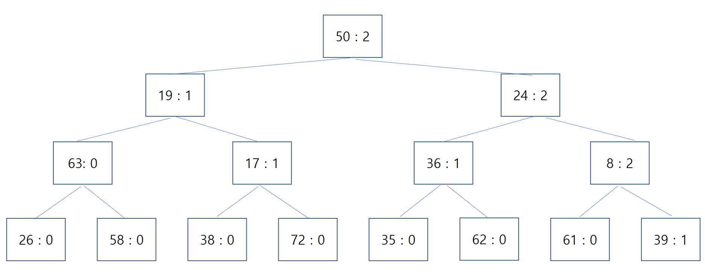
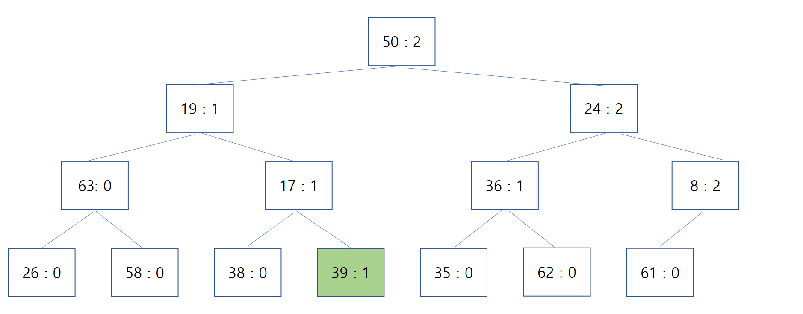
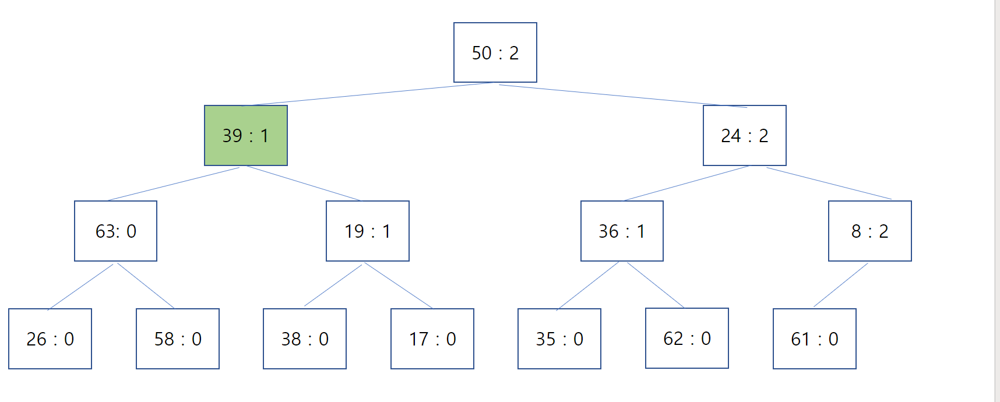

# Heap에서 중간 원소 삭제하기

요즘 삼성전자 SW 역량테스트 B급을 공부할 일이 생겼다. (https://swexpertacademy.com/main/sst/intro.do) 삼성에 3급 공채로 입사할 때 보는 시험은 A급이라고 보면 되고, 삼성 입사 후에 추가로 B급까지 가거나 욕심이 더 있으신 분들은 C급까지 가는 시험이다. 

요즘 역량테스트 B급의 트렌드는 인덱싱(Trie 또는 Hashing) + 우선순위 탐색 (Heap 등)이다. 우선순위 하면 Heap이 먼저 떠오르기야 하지만, SW 역량테스트의 경우 자료구조를 직접 구현해야하는 귀찮음이 있기 때문에 Heap 사용하는 것을 지양하는 편이었다. 

그러나 결국 Heap을 구현할 일이 생겨버렸다. 코드가 잘 기억이 나지 않아서 인터넷의 예시 코드들을 가져다 썼는데, 이 코드들은 삭제 / 삽입을 반복하면서 우선순위를 제대로 유지하지 못했고 디버깅에만 6시간 넘는 시간을 소비하게 만들었다. 확인 결과 예시 코드의 단순함 + Heapify 작업에 대한 미숙한 이해 이렇게 두 가지 이유가 있었고, 이번 기회에 정리하고 넘어가야 겠다는 생각이 들었다.

 

## Heap이란

완전 이진트리의 일종으로, 우선순위 큐를 구현할 때 사용하는 자료구조이다. 루트 노드가 우선순위가 가장 높다는 것은 보장되지만, 모든 원소가 완전히 정렬된 상태는 아니다. 다만 아래와 같은 성질이 성립한다.

> A가 B의 부모노드(parent node) 이면, A의 키(key)값과 B의 키값 사이에는 대소관계가 성립한다. 
 
## Heapify란?

Heap에 원소를 삽입하거나 빼낸 후, 위에서 언급한 성질을 만족하도록 Heap 내 원소들을 재정렬하는 작업이다. 대부분의 예제코드에서 이 작업을 Heapify()라는 함수에 넣어둔다.

Heap에서는 루트 노드가 가장 우선순위가 높은 원소를 가지고 있기 때문에, Heap의 사용 예시나 코드들도 이 부분에 초점이 맞춰져 있다. 여기서 일반적인 Heapify 코드들의 문제가 발생한다. **일반적인 Heap의 삭제는 루트 노드에 대해서만 이뤄지고, 예제 코드들의 Heapify() 루트 노드를 기준으로 자식 노드들에 대해서만 비교하도록 작성된다는 것이다.** 

* 1) Push 이후의 Heapify

원소를 Heap에 삽입하는걸 Push라고 한다. 다음과 같이 이뤄진다.

> Heap의 가장 마지막 노드 뒤에다가 원소를 넣는다.
>
> Heap의 size를 1 증기사킨다.
> 
> 해당 노드에 대해서, 아래 과정을 진행한다.
> 
>1 ) 자신(a)의 부모 노드(p)를 찾는다.
>   
>2-1) p가 존재하지 않는다면 이 과정을 종료한다.
>
>2-2) p의 우선순위가 가장 높다면 이 과정을 종료한다.
>
>2-3) a의 우선순위가 높다면, p와 a의 자리를 바꾼다. 1)로 돌아간다.
>    

맨 마지막 자리로 원소가 들어간 후, 부모 노드와 비교해가며 자신의 자리를 찾아가는 과정이다. 

* 2) Pop 이후의 Heapify

Heap에서 원소를 삭제한다고 하면 보통 Pop이다. Heap에서 루트 노드의 값을 빼오는 것을 Pop이라 한다. Pop이 되면 다음과 같이 Heapify를 진행한다.

> Heap의 가장 마지막 원소를 루트 노드에다가 가져온다.
>
> Heap의 size를 1 줄인다.
> 
> 루트노드부터 아래 과정을 진행한다.
> 
> 1 ) 자신(a)의 우선순위를 자신의 왼쪽 자식 노드(l)와 자신의 오른쪽 자식 노드(r)가 있는지 확인한다. l 또는 r이 존재한다면, 둘과 a의 우선순위를 비교한다.
>  
> 2-2) a의 우선순위가 가장 높다면 이 과정을 끝낸다.
>
> 2-3) l 또는 r이 a보다 우선순위가 높다면, 둘 중 우선순위가 더 높은 노드와 a의 위치를 바꾼다. 바뀐 두 노드 중 자식 노드가 새로운 a가 된다. 1)로 돌아간다.
>       

위 Heapify의 과정을 보면 자신과 자신의 자식 노드에 대해서만 재귀적으로 이뤄진다는 것을 알 수 있다. 하지만 이 Heapify를 중간에 삭제된 노드에 대해서도 똑같이 적용하면 오류가 발생한다. 
 

## 내가 겪은 상황 
아래는 내가 실제로 구현한 Heap의 구조이다. Key와 우선순위로 이뤄져 있는데, 우선순위가 높은 순서대로, 우선순위가 같다면 Key값이 높은 순서대로 정렬되어야한다.

지금 이 상황에서는 Pop을 차례대로 하다보면 우선순위가 높은 순서대로 원소들이 나온다. 문제는 Key : 72인 노드 삭제 이후에 발생했다.

여기서 자식 노드에 대해서만 Heapify를 진행했더니 아래와 같이 Key : 39인 노드가 자리 배치가 제대로 이뤄지지 않았다. 이 때문에 Pop을 여러번 진행할 때 Key : 8 이후에 반환되어야 하는 Key : 39 대신 엉뚱한 Key가 반환 되었다. 

 

## 임의 원소 삭제 이후의 Heapify
위 문제의 원인은 노드의 삭제를 단순히 Pop과 동일시하여 Pop heapify만 진행한 것이다.

루트 노드가 아닌 곳에서 삭제가 이뤄진 경우 다음과 같이 진행해야 한다.

> Heap의 마지막 노드에 존재하는 원소를 삭제한 노드로 옮긴다.
>
> Heap의 size를 1 줄인다.
> 
> 삭제했던 노드 위치를 루트 노드로 하는 Pop  Heapify를 진행한다.
>
> 삭제했던 노드 위치를 시작으로 Push Heapify를 진행한다.

다시 위 자료구조를 제대로 Heapify를 하면 다음과 같다.

 

## 결론
Heapify 는 일반적으로 부모 노드 방향으로, 또는 자식 노드 방향으로만 이뤄진다. 그러나 Heap의 중간 노드 삭제의 경우는 양방향으로 Heapify를 진행해야 한다.
