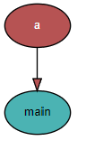
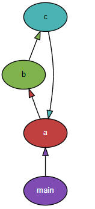
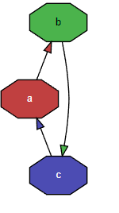

# Visualizing Python Dependencies with Pydeps

When you write Python and sprinkle imports everywhere, sooner or later you run into a circular import error. By the time it happens, you usually have dozens of classes already, and it's not easy to figure out where exactly the cycle is.

I recently had to track down a circular import at work, and that's when I discovered <span style="color:red">**Pydeps**</span>. It helped me not only fix the circular reference but also turned out to be a big help during refactoring.

## What is Pydeps
**Pydeps** is a library that visualizes the dependencies between Python classes.

GitHub: [https://github.com/thebjorn/pydeps](https://github.com/thebjorn/pydeps)

Here is what you get when you analyze the Pydeps library with Pydeps itself.

 <br>

## Installing Pydeps
Installation is a simple pip install. **Note that <span style="color:green">graphviz</span> must already be installed.** Graphviz is graph visualization software that renders abstract graphs and networks as diagrams. As far as I can tell, pydeps analyzes the dependencies, generates a file graphviz can interpret (an svg or dot file, etc.), and then calls graphviz to display the dependency graph.

First, install graphviz from the link below. I'm on Windows, so I used the EXE installer.

graphviz: [http://www.graphviz.org/download/](http://www.graphviz.org/download/)

Once graphviz is installed, install pydeps with pip:

```
pip install pydeps
```


## A quick example

I put together a small Python project like the one below.
It's deliberately contrived to trigger a circular import error, so the content itself doesn't mean much.

```python
# a.py
import b

today = "2022-03-14"

def helloworld():
    print(b.message)
```
```python
# b.py
import c

message = "hello word : " + c.name
```
```python
# c.py
import a

name = "expyh" + a.today
```
```python
# main.py
import a

if __name__ == "__main__":
    a.helloworld()
```

Running main.py produces the circular import error as expected:
```
python main.py

Traceback (most recent call last):
  File "C:\Users\expyh\Desktop\test\main.py", line 1, in <module>
    import a
  File "C:\Users\expyh\Desktop\test\a.py", line 1, in <module>
    import b
  File "C:\Users\expyh\Desktop\test\b.py", line 1, in <module>
    import c
  File "C:\Users\expyh\Desktop\test\c.py", line 3, in <module>
    name = "expyh" + a.today
AttributeError: partially initialized module 'a' has no attribute 'today' (most likely due to a circular import)
```

To spot the circular reference, let's run the pydeps command in the terminal:
```
pydeps main.py
```
 <br>

It shows that main.py imports a — but that alone doesn't reveal the circular relationship. To explore deeper, you need the --max-bacon option.

> --max-bacon INT <br>
> exclude nodes that are more than n hops away (default=2, 0 -> infinite)

On top of that, applying reverse to the arrow direction makes the graph match the dependency direction you'd see in a class diagram.

```
pydeps main.py --max-bacon 0 --reverse
```
 <br>

Now you can see that a.py / b.py / c.py reference each other.

If there are so many files that it's hard to spot by eye, you can show only the cycles with --show-cycles.


```
pydeps main.py --max-bacon 0 --reverse --show-cycles
```
 <br>

## Exporting the dependency graph to a file
In my case, when I used it at work, pydeps failed to recognize graphviz and threw the following error:

```
	ERROR: 
               cannot find 'dot'

               pydeps calls dot (from graphviz) to create svg diagrams,
               please make sure that 
```

As a workaround, you can have pydeps generate an svg or dot file and then run graphviz's dot command separately to view the graph. Use --noshow to keep pydeps from calling an external program, --show-dot to make it emit the dot output, and redirect that with > into a graph.dot file.

>--noshow<br>
>don't call external program to display graph<br>
><br>
>--show-dot<br>
>show output of dot conversion<br>


```
pydeps main.py --max-bacon 0 --reverse --noshow --show-dot > output.dot
```

The generated output.dot looks like this:
```
digraph G {
    concentrate = true;

    rankdir = BT;
    node [style=filled,fillcolor="#ffffff",fontcolor="#000000",fontname=Helvetica,fontsize=10];

    a [fillcolor="#c04040",fontcolor="#ffffff"];
    b [fillcolor="#80b34c"];
    c [fillcolor="#4cb3b3"];
    main [fillcolor="#7f4cb3",fontcolor="#ffffff"];
    c -> a [fillcolor="#4cb3b3"];
    main -> a [fillcolor="#7f4cb3"];
    a -> b [fillcolor="#c04040"];
    b -> c [fillcolor="#80b34c"];
}
```

Since graphviz is already installed, the dot command is available in the terminal. Running it as below renders the graph as an svg file. If you want a different output format, see the -T option at the link below.

Reference: [https://graphviz.org/doc/info/command.html](https://graphviz.org/doc/info/command.html)

```
dot -Tsvg output.dot > output.svg
```
