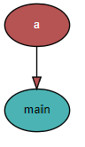
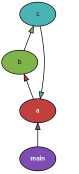
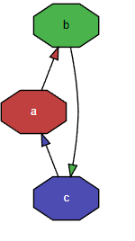

# Pydeps로 Python 의존성 파악하기

파이썬으로 코드를 작성하면서 import를 남발하다 보면 circular import 에(순환참조)가 발생할 때가 있다. 이런 오류가 발생했을 때는 이미 클래스가 수십개가 되어버려서 어느 부분에서 순환참조가 일어난 것인지 찾기 쉽지 않다.

최근에 회사에서 순환참조 오류를 겪으면서 확인해야할 일이 있었는데 이 때 <span style="color:red">**Pydeps**</span> 를 알게 되었고 순환참조 해결 뿐만이 아니라 리펙토링 시에도 많은 도움을 받았다. 

## Pydeps란
**Pydeps**란 Python의 클래스 간 의존성을 시각적으로 표시해주는 라이브러리이다.

Github 주소 : [https://github.com/thebjorn/pydeps](https://github.com/thebjorn/pydeps)

아래는 Pydeps 라이브러리를 Pydeps로 분석한 결과이다.

 <br>

## Pydeps 설치
간단하게 pip 를 이용해서 설치한다. **이 때 <span style="color:green">graphviz</span>가 이미 설치되어 있어야한다**. graphviz는 추상 그래프와 네트워크 등을 다이어그램으로 표현해주는 그래프 비주얼라이제이션 소프트웨어이다. pydeps로 의존성을 분석해서 graphviz가 해석할 수 있는 파일(svg파일이나 dot파일 등) 생성한 후 graphviz를 호출해서 의존성 그래프를 표시해주는 것으로 보인다.

우선 아래 링크를 통해서 graphviz를 설치한다. 나는 윈도우라서 EXE installer를 사용했다.

graphviz : [http://www.graphviz.org/download/](http://www.graphviz.org/download/)

graphviz 설치 후 다음과 같이 pip로 pydeps를 설치한다.

```
pip install pydeps
```


## 간단 예시

아래와 같이 간단한 python 프로젝트를 만들어보았다.
circular import 에러를 유발하기 위해 억지로 만든 프로젝트이기 때문에 내용에 큰 의미는 없다.

```python
# a.py
import b

today = "2022-03-14"

def helloworld():
    print(b.message)
```
```python
# b.py
import c

message = "hello word : " + c.name
```
```python
# c.py
import a

name = "expyh" + a.today
```
```python
# main.py
import a

if __name__ == "__main__":
    a.helloworld()
```

maim.py를 실행시켜보면 circular import 에러 구문이 정상적으로 발생한다
```
python main.py

Traceback (most recent call last):
  File "C:\Users\expyh\Desktop\test\main.py", line 1, in <module>
    import a
  File "C:\Users\expyh\Desktop\test\a.py", line 1, in <module>
    import b
  File "C:\Users\expyh\Desktop\test\b.py", line 1, in <module>
    import c
  File "C:\Users\expyh\Desktop\test\c.py", line 3, in <module>
    name = "expyh" + a.today
AttributeError: partially initialized module 'a' has no attribute 'today' (most likely due to a circular import)
```

순환 참조를 확인하기 위해 터미널에서 pydeps 명령어를 사용해보자
```
pydeps main.py
```
 <br>

main.py 에서 import a를 했다는 것을 표현해준다. 하지만 이것으론 순환참조 관계를 알 수 없다. 더 깊이 탐색하기 위해서는 --max-bacon 옵션을 사용해야한다. 

> --max-bacon INT <br>
> exclude nodes that are more than n hops away (default=2, 0 -> infinite)

여기에 추가로 화살표 방향을 reverse를 적용하면 클래스 다이어그램에서 표현하는 의존관계 방향과 동일하게 표시할 수 있다..

```
pydeps main.py --max-bacon 0 --reverse
```
 <br>

a.py / b.py / c.py가 서로 참조하고 있음을 확인할 수 있다. 

파일이 정말 많아서 육안으로 파악하기 어렵다면 --show-cycles 로 사이클만 표시할 수도 있다.


```
pydeps main.py --max-bacon 0 --reverse --show-cycles
```
 <br>

## 의존성 그래프를 파일로 출력하기 
개인적으로는 회사에서 사용했을 때 pydeps가 graphviz를 인식하지 못해서 다음과 같은 에러가 발생했었다.

```
	ERROR: 
               cannot find 'dot'

               pydeps calls dot (from graphviz) to create svg diagrams,
               please make sure that 
```

이럴 때는 궁여지책으로 pydpes로 svg 또는 dot 파일을 생성한 후, graphviz의 dot 명령어를 별도로 실행해서 그래프를 확인해야한다. --noshow로 외부 프로그램 호출하지 않도록 하고 --show-dot으로 dot 결과물을 생성하도록 한 후 이걸 > 를 사용해서 graph.dot 파일로 리다이렉트 한다. 

>--noshow<br>
>don't call external program to display graph<br>
><br>
>--show-dot<br>
>show output of dot conversion<br>


```
pydeps main.py --max-bacon 0 --reverse --noshow --show-dot > output.dot
```

output.dot은 다음과 같이 생성된다.
```
digraph G {
    concentrate = true;

    rankdir = BT;
    node [style=filled,fillcolor="#ffffff",fontcolor="#000000",fontname=Helvetica,fontsize=10];

    a [fillcolor="#c04040",fontcolor="#ffffff"];
    b [fillcolor="#80b34c"];
    c [fillcolor="#4cb3b3"];
    main [fillcolor="#7f4cb3",fontcolor="#ffffff"];
    c -> a [fillcolor="#4cb3b3"];
    main -> a [fillcolor="#7f4cb3"];
    a -> b [fillcolor="#c04040"];
    b -> c [fillcolor="#80b34c"];
}
```

graphviz를 이미 설치했으므로 터미널에서 dot 명령어를 사용할 수 있다. 아래와 같이 실행하면 그래프를 svg파일로 표시할 수 있다. 다른 파일 형태로 표시하고 싶다면 아래 링크에서 -T 옵션을 참고하도록 한다.

참고 : [https://graphviz.org/doc/info/command.html](https://graphviz.org/doc/info/command.html)

```
dot -Tsvg output.dot > output.svg
```
