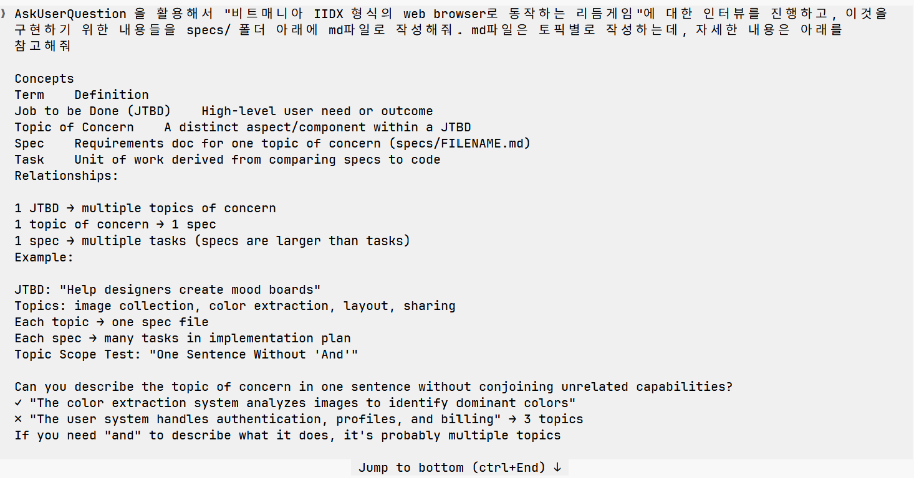
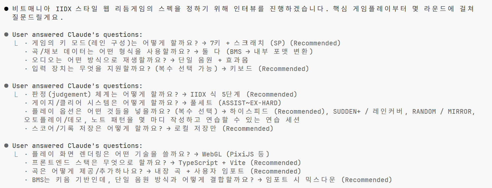
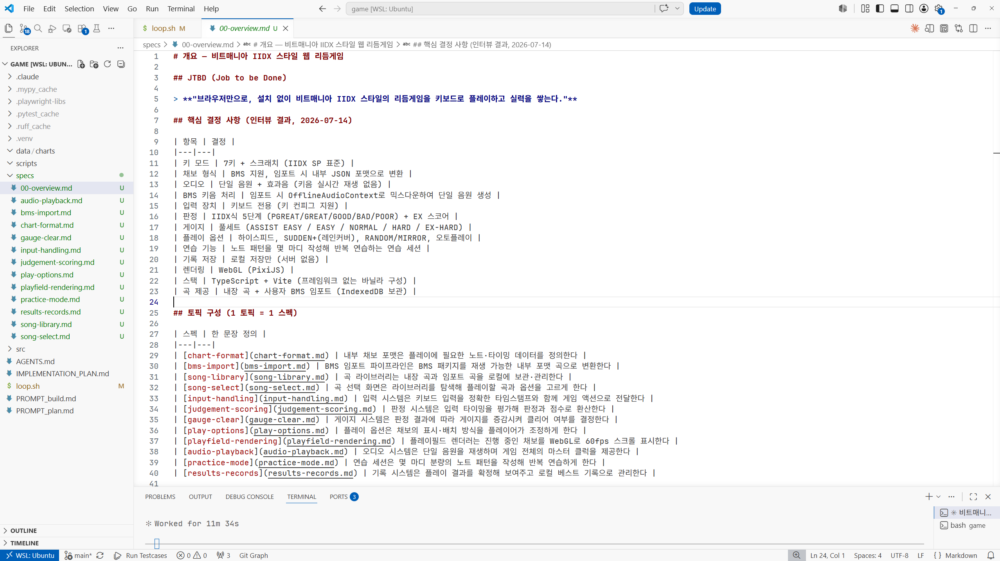
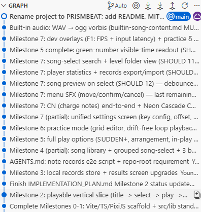

# Building a Rhythm Game with the Ralph Loop

This post is about my *experience* and *impressions* of building a rhythm game with the `Ralph Loop` methodology, using Claude and [The Ralph Playbook](https://github.com/ClaytonFarr/ralph-playbook).
I won't go into much detail about the definition, theory, or exact application of the Ralph Loop itself.

Since this is still an ongoing toy project, for now I'm just listing my impressions as they are, without drawing any conclusions.

Below is an example of the game implemented with the `Ralph Loop`.

The actual code lives here:

[https://github.com/dubli91/rhythm_game](https://github.com/dubli91/rhythm_game)

<video controls width="100%">
  <source src="/blog/posts/images/260717/play_optimized.mp4" type="video/mp4">
  Your browser does not support the video tag.
</video>

# Background
I had decided I should try Claude at home for myself and signed up for the $110 MAX plan — but after a full day of work at the office, actually turning the computer back on at home turned out to be harder than expected. While my credits were quietly rotting away, a friend's recommendation introduced me to the `Ralph Loop`.

<iframe width="560" height="315" src="https://www.youtube.com/embed/_IK18goX4X8?si=ZwcyfG7DHw8A7Zmr" title="YouTube video player" frameborder="0" allow="accelerometer; autoplay; clipboard-write; encrypted-media; gyroscope; picture-in-picture; web-share" referrerpolicy="strict-origin-when-cross-origin" allowfullscreen></iframe>

At the same time, I was hitting a wall trying to improve while working on hard-clearing level 12 charts in Beatmania IIDX. I thought a toy project along the lines of "a simple rhythm game I can practice on at home with a keyboard, charting my own patterns" would be fun — but with zero knowledge of game programming or frontend development, I couldn't get it off the ground.

That's when I discovered [The Ralph Playbook](https://github.com/ClaytonFarr/ralph-playbook), a GitHub repository that distills its own set of best practices out of careful deliberation.

And I got curious: what if I built a rhythm game with the `Ralph Loop`?

# Getting started
First, I skimmed through the README of `The Ralph Playbook`. The structure and workflow as I understood them were as follows.

1. Referring to the files in [The Ralph Playbook](https://github.com/ClaytonFarr/ralph-playbook) repository, set up a folder structure like this:
```
project-root/
├── loop.sh                         # Ralph loop script
├── PROMPT_build.md                 # Build mode instructions
├── PROMPT_plan.md                  # Plan mode instructions
├── AGENTS.md                       # Operational guide loaded each iteration
├── IMPLEMENTATION_PLAN.md          # Prioritized task list (generated/updated by Ralph)
├── specs/                          # Requirement specs (one per JTBD topic)
│   ├── [jtbd-topic-a].md
│   └── [jtbd-topic-b].md
├── src/                            # Application source code
└── src/lib/                        # Shared utilities & components
```
2. Write the specs you want implemented as md files under the specs/ folder. For what a spec should look like, refer to [Concepts](https://github.com/ClaytonFarr/ralph-playbook#concepts).
3. Generate IMPLEMENTATION_PLAN.md with the command below (steps 1–2).
```
./loop.sh plan {count}
```
4. Run the command below as many times as you like, indefinitely (the last argument is the number of iterations).
```
./loop.sh build {count}
```


For reference, my development environment was as follows.

```
Local machine : Galaxy Book Pro 5
Coding agent  : Claude Fable (plan: MAX, $110/mo)
Runtime       : Run directly over WSL, connected through VSCode
```
# Writing the specs

I've been playing Beatmania IIDX for over a decade, but when it came to actually writing the specs, I was at a loss. Fortunately, `The Ralph Playbook` includes a tip about using Claude's [AskUserQuestionTool](https://github.com/ClaytonFarr/ralph-playbook#use-claudes-askuserquestiontool-for-planning), as shown below. (As I understand it, tools other than Claude — Codex and the like — have something similar.)

> Invoke: "Interview me using AskUserQuestion to understand [JTBD/topic/acceptance criteria/...]"

I asked my question in Korean, roughly as follows. It's a bit long, so I've collapsed it below. When I first tried using AskUserQuestion alone, I noticed Claude cramming all the specs into a single file, which violates the "one topic per file" rule that `The Ralph Playbook` recommends — so I added explicit guidance about the spec files as well.

<details>
<summary>Expand the question</summary>
Using AskUserQuestion, interview me about "a Beatmania IIDX-style rhythm game that runs in a web browser," and write up what's needed to implement it as md files under the specs/ folder. Write one md file per topic — see below for details.

Concepts
Term    Definition
Job to be Done (JTBD)    High-level user need or outcome
Topic of Concern    A distinct aspect/component within a JTBD
Spec    Requirements doc for one topic of concern (specs/FILENAME.md)
Task    Unit of work derived from comparing specs to code
Relationships:

1 JTBD → multiple topics of concern
1 topic of concern → 1 spec
1 spec → multiple tasks (specs are larger than tasks)
Example:

JTBD: "Help designers create mood boards"
Topics: image collection, color extraction, layout, sharing
Each topic → one spec file
Each spec → many tasks in implementation plan
Topic Scope Test: "One Sentence Without 'And'"

Can you describe the topic of concern in one sentence without conjoining >unrelated capabilities?
✓ "The color extraction system analyzes images to identify dominant colors"
✗ "The user system handles authentication, profiles, and billing" → 3 >topics
If you need "and" to describe what it does, it's probably multiple topics
</details>

</br>



With the AskUserQuestion tool, the agent interviews you directly to figure out what it needs. I was surprised at how detailed the questions were, and at how well it knew Beatmania IIDX. It asked about things I hadn't even planned to implement — lane covers, note arrangement options, BMS file import — and wrote the specs itself. I was honestly a little moved.



Once the Q&A is done, md files are generated in the specs folder. Below is an example of the overview file.



Originally I intended to use FastAPI for the backend. It's the backend framework I'm most familiar with, and I wanted some way to evaluate what the `Ralph Loop` produced. But as the specs got written, both backend and frontend ended up JS-based, and it unintentionally turned into full-on vibe coding.

Of course, after the specs are written — or even mid-build — some specs turn out not to my liking. Even then, I never created or edited spec files myself; I just asked Claude to revise them.

# Plan and build

Then I ran plan and build. Running loop.sh with the appropriate arguments kicks off a script that runs Claude headlessly. It reads the specs folder and IMPLEMENTATION_PLAN.md on its own, decides on priorities, implements things itself, and even handles commit and push.
[loop.sh](https://github.com/ClaytonFarr/ralph-playbook/blob/main/files/loop.sh) was written with the Opus model in mind, but since Fable had just been released, I modified loop.sh to use Fable instead of Opus.
I ran plan once, and after that I repeatedly ran build in iterations of 2–3.

When I first set up Claude, I had put constraints in place so Claude could not run git commit / push (i.e., so I would write and drive those myself). Because of this, git commit / push didn't go through properly early on.



With every commit, tests and features were fully written and left in a runnable state. After each build loop finished, I could run the project, see the implemented result for myself, and think about adding or revising specs.

Another thing that amazed me: it even created sample music and charts, bringing everything to a genuinely playable level. From what I could find, it didn't seem to have pulled music or charts from anywhere online. It really made me wonder — and look forward to — where the limits of AI agents will turn out to be.


# Impressions so far
About four days of work have gone in so far, and in that time it managed to produce genuinely meaningful results.
But the build isn't finished. I don't yet know how far my requirements will keep going, or at what point I could call it done. So for now, let me just loosely organize my impressions to date.

## The positives
- It really does handle things **on its own**, more than I expected. From spec writing to planning to building, it does everything itself. All I had to do was the initial setup, keep running loop.sh, and fix the specs I didn't like.
  - I almost never had to touch the code directly, so it felt quite approachable — not much of a hurdle even for a non-developer.
- It saves a huge amount of developer time.
  - Once the initial setup is done right, there's nothing to touch, so the time efficiency was excellent. I ran 2–3 builds once before work, once after work, and once before bed.
- I liked that every build implements and commits a working feature.
  - I could run it at any point to check the current state.
  - The git commit history was well kept, which made it easy to review the work or roll back.

## The negatives
- The raw token usage and wall-clock time are pretty high, I think. It seems that on every loop it reads through all the files, re-establishes priorities and plans, and then proceeds — so it's bound to take more time and tokens than a human setting priorities and directing it via prompts.
  - Personally I'm on the $110 plan, and around ./loop.sh build 3 was enough to burn through the entire 5-hour session token limit. You need at least the $110 plan, and for a somewhat larger project the $220 plan looks like the baseline.
  - Token consumption was so heavy that I later cut a few features I didn't need (BMS file import, among others).
- I have doubts about whether this could be used for a real production service.
  - I'm not sure a developer could responsibly own operations and maintenance of it in a professional setting. What would coworkers think, how would handover work, and so on.
  - Even a simple toy project at home devours tokens — running this directly on a mid-to-large real service? I'm not sure the company would love that.


## Things I couldn't verify
- Judging by the output alone, the design / UI / UX isn't particularly polished. Granted, I put in zero requirements on that front, but I'm curious whether a professional designer joining in would improve it a lot, or whether Claude still has limits here.
- The current toy project is a simple server running locally. I don't know whether the `Ralph Loop` could properly handle development that involves a variety of components (databases, cloud providers, CI/CD, and so on).
