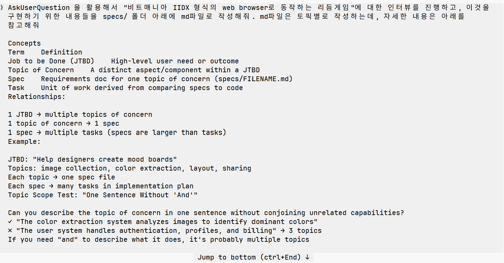
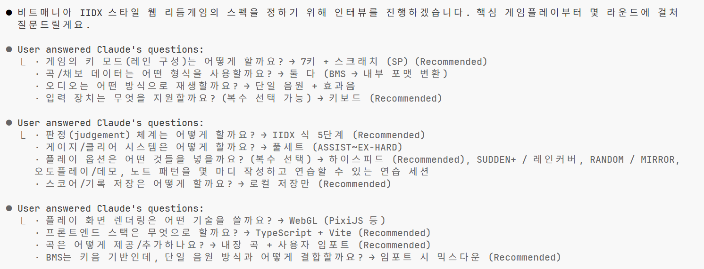
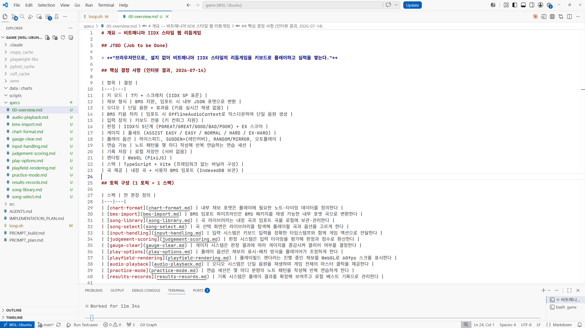
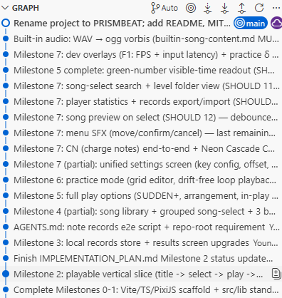

# Ralph loop 를 활용한 리듬게임 만들기

이 글에서는 Claude 및 [The Ralph Playbook](https://github.com/ClaytonFarr/ralph-playbook)를 활용하여 `Ralph Loop` 방법론을 통해 리듬게임을 개발한 *경험* 및 *느낀점*에 대해 작성합니다.
Ralph Loop의 정의, 이론, 자세한 적용방법 등에 대해서는 그다지 다루지 않습니다.

아직 진행중인 토이 프로젝트이기 때문에 현재는 느낀 점만 단순 나열하며, 결론은 내리지 않았습니다.

아래는 `Ralph Loop` 로 구현한 게임 예시입니다.

<video controls width="100%">
  <source src="/blog/posts/images/260717/play_optimized.mp4" type="video/mp4">
  브라우저가 동영상을 지원하지 않습니다.
</video>

# 개요
Claude를 집에서도 직접 써봐야겠다고 결심하고 $110 달러짜리 MAX 요금제를 결제했지만, 막상 하루종일 회사에서 업무하고 집에 와서 다시 컴퓨터는 켜는 것은 쉽지 않은 일이었습니다. 그렇게 크레딧이 썩어가던 찰나, 친구의 추천으로 `Ralph Loop`에 대해 알게 됩니다.

<iframe width="560" height="315" src="https://www.youtube.com/embed/_IK18goX4X8?si=ZwcyfG7DHw8A7Zmr" title="YouTube video player" frameborder="0" allow="accelerometer; autoplay; clipboard-write; encrypted-media; gyroscope; picture-in-picture; web-share" referrerpolicy="strict-origin-when-cross-origin" allowfullscreen></iframe>

동시에, 저는 Beatmania IIDX 12레벨 하드클리어 도중 실력 향상에 한계를 느끼고 있었는데요. "집에서 간단하게 패턴을 찍어서 키보드로 연습할 수 있는 수준의 리듬게임"이라는 주제로 토이 프로젝트를 진행하면 어떨까 싶었지만, 저는 게임 프로그래밍이라던가 프론트엔드쪽 지식은 전무했어서 진행을 하지 못하는 상황이었습니다. 

그러던 와중에 나름의 고민을 통해 베스트 프랙티스를 도출해 낸 [The Ralph Playbook](https://github.com/ClaytonFarr/ralph-playbook) 깃헙 저장소를 발견하게 됩니다. 

이 때 리듬게임을 `Ralph Loop`로 구현해보면 어떨까? 궁금해졌습니다.

# 시작하기 
일단 `The Ralph Playbook`의 README를 훑어보았습니다. 제가 파악한 구조 및 작업방식은 다음과 같았습니다.

1. [The Ralph Playbook](https://github.com/ClaytonFarr/ralph-playbook) 저장소 내 파일들을 참고하여 다음과 같은 폴더를 구성한다.
```
project-root/
├── loop.sh                         # Ralph loop script
├── PROMPT_build.md                 # Build mode instructions
├── PROMPT_plan.md                  # Plan mode instructions
├── AGENTS.md                       # Operational guide loaded each iteration
├── IMPLEMENTATION_PLAN.md          # Prioritized task list (generated/updated by Ralph)
├── specs/                          # Requirement specs (one per JTBD topic)
│   ├── [jtbd-topic-a].md
│   └── [jtbd-topic-b].md
├── src/                            # Application source code
└── src/lib/                        # Shared utilities & components
```
2. specs/ 폴더 아래에 md형식으로 구현하고 싶은 스펙을 적는다. 이 때의 spec은 [Concepts](https://github.com/ClaytonFarr/ralph-playbook#concepts)를 참고한다.
3. 아래 명령어로 IMPLEMENTATION_PLAN.md를 생성한다(1~2번).
```
./loop.sh plan {횟수} 
``` 
4. 아래 명령어를 원하는 만큼 무한으로 돌린다 (맨 마지막 인자가 반복 횟수이다). 
```
./loop.sh build {횟수}
```

참고로 저의 개발환경은 다음과 같습니다.
</br>
- 로컬 환경 : 갤럭시 북 프로 5
- 코딩 에이전트 : Claude Fable (요금제 : MAX, $110/mo)
- 실행 환경 : VSCode를 통해 WSL 연결 후 직접 실행

# spec 작성하기

제가 Beatmania IIDX를 1n년간 플레이해왔지만 막상 spec을 작성하려니 막막했습니다. 다행히 `The Ralph Playbook`에서는 아래와 같이 Claude의 [AskUserQuestionTool](https://github.com/ClaytonFarr/ralph-playbook#use-claudes-askuserquestiontool-for-planning)을 사용하는 팁이 명시되어 있었습니다. (Claude가 아닌 Codex 등에도 비슷한 툴이 있는 것으로 알고 있습니다)

> Invoke: "Interview me using AskUserQuestion to understand [JTBD/topic/acceptance criteria/...]"

저는 한국어로 다음과 같이 물어보았습니다. 조금 길어서 아래와 같이 접어두었습니다. 처음에 AskUserQuestion만 사용해본 결과 Claude가 spec을 한 파일에 몰아서 작성하는 걸 확인했는데, 이는 `The Ralph Playbook`에서 권고하는 "한 파일 당 하나의 토픽"에 위배되기 때문에 spec 파일에 대한 명시적 안내문도 추가하였습니다.

<details>
<summary>질문 펼치기</summary>
AskUserQuestion 을 활용해서 "비트매니아 IIDX 형식의 web browser로 동작하는 >리듬게임"에 대한 인터뷰를 진행하고, 이것을 구현하기 위한 내용들을 specs/ 폴더 아래에 >md파일로 작성해줘. md파일은 토픽별로 작성하는데, 자세한 내용은 아래를 참고해줘

Concepts
Term    Definition
Job to be Done (JTBD)    High-level user need or outcome
Topic of Concern    A distinct aspect/component within a JTBD
Spec    Requirements doc for one topic of concern (specs/FILENAME.md)
Task    Unit of work derived from comparing specs to code
Relationships:

1 JTBD → multiple topics of concern
1 topic of concern → 1 spec
1 spec → multiple tasks (specs are larger than tasks)
Example:

JTBD: "Help designers create mood boards"
Topics: image collection, color extraction, layout, sharing
Each topic → one spec file
Each spec → many tasks in implementation plan
Topic Scope Test: "One Sentence Without 'And'"

Can you describe the topic of concern in one sentence without conjoining >unrelated capabilities?
✓ "The color extraction system analyzes images to identify dominant colors"
✗ "The user system handles authentication, profiles, and billing" → 3 >topics
If you need "and" to describe what it does, it's probably multiple topics
</details>

</br>



AskUserQuestion 툴은 에이전트가 직접 사용자에게 인터뷰를 진행하면서 필요한 내용을 파악하는데요. 생각보다 엄청 자세하게 물어보고 또 Beatmania IIDX에 대한 내용을 잘 알고 있어서 놀랐습니다. 제가 굳이 구현할 생각도 않았던 레인커버, 배치옵션, BMS 파일 임포트 등까지 물어보고 직접 spec을 작성하는 모습에 조금은 감동을 받았습니다.



질의응답이 끝나면 specs폴더에 md파일들이 생성됩니다. 아래는 개요 파일의 예시입니다.



원래는 백엔드로 FastAPI를 사용하려 했습니다. 제가 익숙한 백엔드 프레임워크이기도 하고 `Ralph Loop`가 생성한 결과물을 나름 평가해보려는 목적이었는데요. spec을 작성하다보니 백엔드+프론트엔드 모두 js기반으로 설정되어 의도치않게 완전한 바이브코딩이 되어버렸습니다. 

물론 spec들이 작성된 후, 또는 빌드를 진행하면서도 맘에 들지 않는 spec들이 나오는데요 텐데요. 이런 경우에도 저는 직접 spec파일을 생성하거나 작성하지 않고 그냥 claude에게 spec 수정을 맡겼습니다. 

# plan과 build

이제 plan과 build를 실행했습니다. loop.sh를 적절한 인자를 넣고 실행하면 claude 를 헤드리스로 실행하는 스크립트가 실행됩니다. Specs 폴더 및 IMPLAMANTATION_PLAN.md를 알아서 읽고, 우선순위를 결정하고, 직접 구현하고, 커밋 및 푸시까지 알아서 진행합니다.
[loop.sh](https://github.com/ClaytonFarr/ralph-playbook/blob/main/files/loop.sh)은 Opus 모델 기준으로 작성되었는데 최근에 Fable이 공개되었기 때문에, Opus 대신 Fable을 쓰도록 loop.sh에서 수정해 주었습니다. 
plan은 1번 돌렸고, 이후로는 build를 2-3번의 이터레이션으로 반복 실행했습니다.

제가 Claude 초기 세팅 시 Claude는 git commit / push를 실행할 수 없도록(즉, 제가 직접 작성 및 진행하도록) 제약을 걸어놨었는데요. 이 때문에 초반에 git commit / push이 제대로 진행되지 않았습니다.



매 커밋마다 테스트 및 기능이 온전히 작성되었으며, 실행 가능한 형태로 정리되었습니다. 빌드 실행 루프가 한 번씩 끝날 때마다 실행해서 직접 구현된 결과물을 확인할 수 있었고 spec 추가 및 수정을 고려해볼 수 있었습니다.

또 여기서 놀라웠던 점은 예시 음악 및 채보까지 다 만들어서 실제 구현 가능한 수준으로 만들어 두었다는 점입니다. 제가 검색해 본 결과로는 온라인에 있는 음악 및 채보를 가져다 쓴 것 같지는 않았습니다. AI 에이전트의 한계가 어디까지일지 앞으로도 정말 기대가 되는 부분이었습니다.


# 지금까지의 느낀 점
현재까지 약 4일 정도의 작업이 진행되었습니다. 그 와중에 꽤 유의미한 결과물을 만들어낼 수 있었습니다.
하지만 빌드가 끝난 것은 아닙니다. 저의 요구사항이 어디까지 이어질지, 언제가 완성이라고 말할 수 있는지는 아직 모르겠습니다. 그렇기 때문에 지금까지의 느낀 점을 적당히 정리해보려 합니다.

## 긍정적인 측면
- 생각보다 정말 **알아서** 잘 해줍니다. 스펙 작성부터 계획 빌드까지 전부 스스로 합니다. 제가 할 일은 초반 세팅, 지속적으로 loop.sh 실행하기, 그리고 맘에 안드는 스펙 수정하기 정도였습니다. 
  - 코드를 직접 건드릴 일이 거의 없어, 비전공자 수준에게도 크게 어렵지 않아서 접근성이 좋다는 생각이 들었습니다.
- 개발자의 시간을 크게 아낄 수 있습니다.
  - 초반 세팅만 잘 해 놓으면 손 댈일이 없기 때문에 시간 효율이 정말 좋았습니다. 저도 출근 전 한 번, 퇴근 후 한 번, 자기 전 한 번 build를 2-3회정도 돌렸습니다.
- 매 빌드마다 유효한 기능을 구현하고 커밋한다는 점이 좋았습니다.
  - 언제든지 직접 실행해서 현 상황을 확인할 수 있었습니다.
  - git 커밋 이력이 잘 남아서 작업 내용을 확인하거나 롤백등을 하기에도 좋았습니다. 

## 부정적인 측면
- 절대적인 토큰 및 실행 시간은 좀 많이 든다고 생각합니다. 아마도 매 루프 실행마다 파일을 일일이 다 읽고, 우선순위 및 계획을 다시 세우고 진행하는 것 같은데, 사람이 우선순위를 정해서 프롬프트로 지시하는 것 보다는 실행시간 및 토큰이 많이 들 수 밖에 없는 것 같습니다.
  - 개인적으로는 $110 달러 요금제를 쓰고 있는데, ./loop.sh build 3 정도면 5시간 세션 토큰 제한을 전부 사용했습니다. 최소 $110을 써야하고, 좀 더 큰 프로젝트는 $220달러 요금제는 기본으로 써야할 것 같습니다.
  - 토큰이 너무 많이 소모되어서 차후에는 필요 없는 기능들을 몇 개 빼기도 했습니다(BMS 파일 임포트 등).
- 이걸 실제 서비스용 활용할수 있는가? 에 대한 의문이 있습니다. 
  - 현업에서 개발자가 직접 운영 / 유지보수를 책임감있게 진행 할 수 있을지는 모르겠습니다. 같이 현업하는 동료들은 어떻게 생각할지, 인수인계는 어떻게 할지 등등.
  - 집에서 간단한 토이 프로젝트만 해도 토큰을 엄청 잡아먹는데, 이걸 중-대형의 실제 서비스에서 직접 돌린다? 회사에서 좋아할지 모르겠습니다.


## 확인하지 못한 측면
- 구현 결과물만 봐서는 디자인 / UI / UX가 그다지 유려하진 않은 것 같습니다. 제가 이 쪽 요구사항을 전혀 안넣긴 했지만, 이 부분도 현업의 디자이너가 오면 많이 개선될지, 아니면 아직은 Claude로는 한계가 있을지 궁금합니다.
- 현재 구현한 토이 프로젝트는 로컬에서 돌아가는 단순 서버입니다. 다양한 컴포넌트(DB나 Cloud Provider, CI/CD 등)가 엮여있는 개발도 `Ralph Loop`가 제대로 구현할 수 있을지 모르겠습니다.

