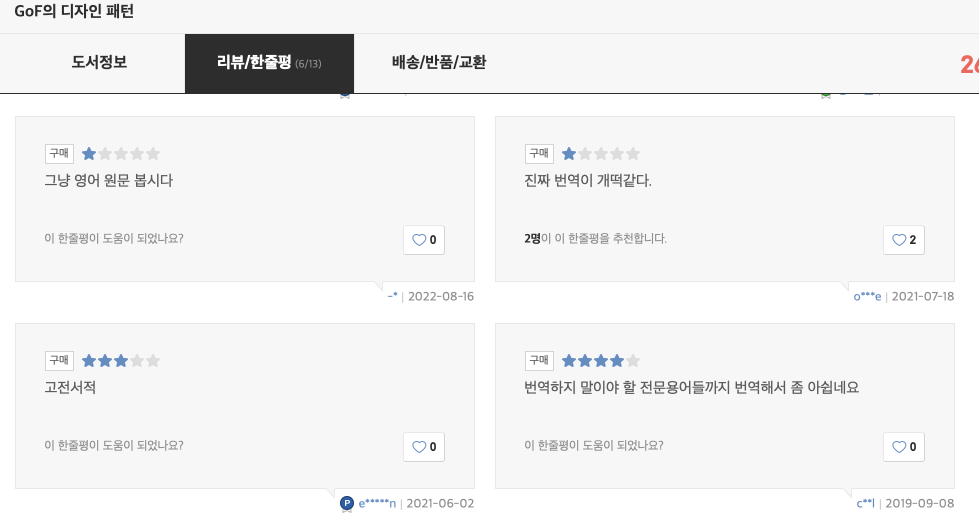

# A Developer's Reading Life - Translations vs. Originals

Making a living as a developer in the IT industry means there is always way too much to study. I recently even saw someone argue that the "excessive amount of studying" is why there are fewer developers in their 30s and 40s.
New technologies keep pouring out in software development, and to keep from falling behind, developers have to constantly study theory and apply it in practice — and the argument was that this demands far too much time and effort relative to the average developer salary.
With that much study effort and talent, the reasoning goes, you would build more wealth going into another profession or starting a business, which is why so many people quit partway through.
Lately I have caught myself having similar thoughts (while grumbling about having to learn yet another thing, skimming the official docs of some framework I had never seen before — do I really have to keep studying things I might never use, for the rest of my life?), but so far programming is still fun for me and seems to suit my personality, so I keep at it.

The ways developers absorb information have diversified (blogs, YouTube, and so on), but books written by renowned developers still seem to be the most trustworthy resources. Yet when you browse reviews before buying a book to study from, one complaint comes up surprisingly often — the quality of the translation is poor.
The typical criticisms were things like "it reads like machine translation" or "I only understood it after looking up the original text."  

You would think the famous books — the ones people call bibles — would be free from this problem, but surprisingly they are not. Recently my company allocated a budget for each team to buy development books.
I was going to request the bible of all developer bibles, the Gang of Four's "Design Patterns: Elements of Reusable Object-Oriented Software." Naturally I looked for the Korean translation first, and discovered that even this book gets plenty of criticism for its translation.

I suspect these complaints come from reasons like the following:
- The translator has no knowledge of the field at all (though I imagine this rarely happens)
- Words normally written in English were awkwardly forced into Korean (should "Queue" be transliterated, rendered as "waiting line," or just "line"?)
- A brand-new concept had to be introduced and the translator picked an ill-fitting Korean term (naming things really is the hardest problem in the world)
- The original author simply wasn't a good writer (they are, after all, engineers)

---

I once dreamed of becoming a translator myself, so I fully sympathize with how difficult the work is — but at the end of the day I'm a consumer too, and I can't just close my eyes and pretend the problem doesn't exist.
I have always weighed "reading the original" against "reading the translation" with the following pros and cons in mind:
- Pros of the original: **100% free of translation problems** (because there's no translation! And most books are published in English anyway). There is also a very good chance an e-book exists (even a PDF is greatly appreciated).
- Cons of the original: a different kind of translation problem still exists (**I am Korean**). Even if I understand a page 100%, my reading speed inevitably drops dramatically compared to a Korean book. On top of that, with the dollar exchange rate these days, books have gotten relatively expensive.
- Pros of the translation: **I can read it very quickly**. I can tell at a glance what I already know and what I don't, and skim accordingly.
- Cons of the translation: some translation issues, plus e-books that are either nonexistent or PDF-only.

Translation quality is one thing, but whether an e-book exists is a huge factor for me. My home is very small with no room left for books, and programming books tend to be thick, packed with diagrams and code.
Korean publishers in particular have no concept of a paperback and tend to make books excessively luxurious, which makes them terrible to carry around and read.
So I usually read on a Kindle or an iPad, but translated books mostly have no e-book edition or come only as PDFs, which puts significant limits on things like font sizing and indexing features.

---

Even so, my choice in the end was the translation. I already had new concepts to absorb and move past, and I wanted to pick things up quickly and keep going — not wrestle with English along the way.  

Lately, though, I have been trying to change my mind bit by bit. It hit me that English is a problem I will carry with me for my entire life as a developer. New technologies always arrive in English first, and better career opportunities go disproportionately to those who can use English.
Starting now, I need to build up my skill at reading English documentation. Even if I never get to free-flowing conversation with native speakers, I should at least be able to read documents without difficulty. If I keep avoiding it, I will never get used to it. So I decided to steel myself a little.  

Besides, machine translation has gotten remarkably good these days. Amazon's e-book reader even has a menu for using Bing Translator right inline, so I can grab a hint whenever I get stuck.

--- 

For now I decided to start with something lighter than technical documentation. I am currently reading "Stolen Focus: Why You Can't Pay Attention--and How to Think Deeply Again" in the original English (published in Korean as "도둑맞은 집중력"). Once I get a bit more comfortable, I'll move on to the Design Patterns book my team bought for me.
