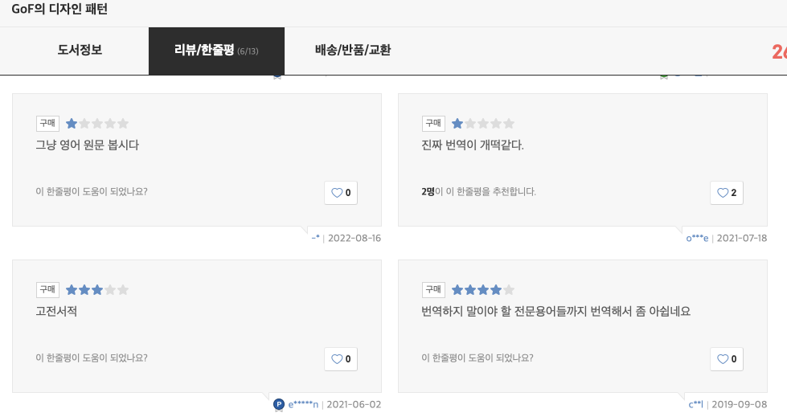

# 개발자의 독서 - 번역본 vs. 원서

IT 업계에서 개발자 업무로 밥벌어먹고 살기 위해서는 공부할 일이 너무 많다. 최근에는 30-40대 개발자들이 줄어드는 이유로 "지나친 공부량"을 주장하는 사람도 봤었다. 
IT 개발쪽으로 새로운 기술이 쏟아져나오고, 개발자는 이에 뒤쳐지지 않게 이론 공부 + 실전 적용을 꾸준히 해야하는데, 이게 개발자들의 평균 연봉에 비해 지나치게 많은 시간과 노력을 요한다는 글이었다. 
이 정도 공부량과 재능이면 그냥 다른 전문직이나 사업을 벌이는 것이 더 많은 부를 쌓는 편이라서 중간에 그만두는 경우가 많다는거다. 
최근에는 나도(또 새로운 걸 공부해야한다고 투덜대면서 처음 보는 프레임워크의 공식문서를 훑으며) 비슷한 생각을 종종 했지만(평생 이런 식으로 내가 처음 보는 걸 언제까지 쓸 지도 모르는데 공부해야하나?), 그래도 아직까지는 프로그래밍 쪽이 재밌고 내 성격이랑도 맞는 것 같아서 하고 있다.

개발자로서 정보를 습득하는 경로가 다양해졌지만(블로그, 유튜브 등), 아직은 저명한 개발자가 쓴 책들이 가장 신뢰도가 높은 자료들인 것 같다. 그러나 책으로 공부하기 위해 리뷰를 보다보면 심심찮게 나오는 의견들이 있다 - 번역의 수준이 떨어진다는 것이다. 
일반적으로는 "번역기 돌린 것 같다"라던지 "원문을 찾아보고 겨우 이해했다"등의 비판들이 많았다.  

흔히 바이블이라고 불리는 유명한 책들은 이런 문제에서 자유로울 것 같지만, 의외로 아니다. 최근에 우리 회사는 부서마다 개발도서를 살 수 있도록 지원금을 할당했었다.
나는 개발자들의 바이블 중의 바이블, Gang of 4의 "Design Patterns: Elements of Reusable Object-Oriented Software "라는 책을 구매 요청하려고 했었다. 당연히 처음에는 한글 번역본 찾았었는데, 이 책조차 번역 문제에 대한 비판이 꽤 많다는 것을 알게 되었다.

이런 의견들이 나오는 데에는 다음과 같은 이유가 있을 것 같다.
- 저자가 해당 분야에 대한 지식이 전혀 없다 (그러나 이런 일은 거의 없을 것이라 생각한다)
- 일반적으로 영어로 쓰는 단어를 굳이 어설프게 한글로 바꿨다 (Queue를 큐라고 할지 대기열이라고 할지 줄이라고 할지 등등..)
- 아예 새로운 개념을 소개해야 하는데 번역가가 적절치 않은 한글로 바꿨다 (변수 명 짓는게 세상에서 제일 어렵다)
- 원작가가 그냥 글을 못썼다 (그들도 결국 이과생들이다)

---

번역가의 꿈을 꾼 적도 있어서 번역의 어려움이나 고충은 충분히 공감하고 있지만, 결국엔 나도 소비자기 때문에 이 문제를 눈 감고 모른척 할 수는 없다. 
나는 항상 "원서 읽기" 와 "번역본 읽기"에 대해 다음과 같은 장단점을 가지고 고민했다.
- 원서의 장점 : **번역문제에서 100퍼센트 자유롭다**(번역을 안하니까! 그리고 대부분의 책들이 영어로 나오니까). 그리고 전자책이 존재할 확률이 매우 높다(pdf 포맷이어도 아주 고맙다)
- 원서의 단점 : 다른 의미의 번역문제가 여전히 존재한다(**나는 한국인이다**). 한 페이지가 100퍼센트 이해되는 글이라 하더라도 한글 책에 비해 독서 속도가 현저히 떨어질 수 밖에 없다. 추가로 요즘 달러 환율 때문에 책이 상대적으로 비싸졌다.
- 번역본의 장점 : **매우 빠르게 읽을 수 있다**. 아는 내용과 모르는 내용을 훑어보는 것 만으로도 알 수 있고 이를 넘기면서 읽을 수 있다.
- 번역본의 단점 : 약간의 번역문제, 그리고 전무하거나 pdf뿐인 전자책들.

번역 수준도 문제지만, 전자책 존재 여부가 나에게는 엄청 큰 요소이다. 내 집은 매우 좁아서 더 이상 책을 둘 데도 없으며, 프로그래밍 서적들은 도표와 코드가 많아 두꺼운 편이다.
특히 한국의 책들은 페이퍼백이라는 개념이 없고 책을 지나치게 럭셔리하게 만드는 경향이 있어 들고 다니면서 읽기에 좋지 않다. 
그래서 보통 Kindle이나 ipad로 책을 읽곤 하는데, 번역본은 대부분 전자책이 없거나 pdf형식이라 글자 크기라던지 인덱싱 기능들을 사용하는데 상당한 제약이 있다.

---

그럼에도 내 선택은 결국 번역본이었다. 안그래도 새로운 개념을 익히고 다음으로 넘어가야하는데, 빨리빨리 습득하고 넘어가고 싶지 영어 문제로 골머리를 썩히고 싶진 않았기 때문이다.    

하지만 요즘은 생각을 조금씩 바꾸려 하고 있다. 영어는 개발자로서 평생을 안고 가야 할 문제라는 생각이 들었기 때문이다. 새로운 기술들은 항상 영어로 나오고 있고, 또 직장으로서 더 좋은 기회들도 영어를 쓰는 자에게 더 많이 주어지니까. 
지금부터라도 영어로 된 문서를 읽는 스킬을 더 익혀야한다. 원어민과의 프리토킹을 아닐 지라도, 최소한 문서 읽는데는 어려움이 없어야지. 지금부터 피하고 다니면 평생 익숙해 질 일은 없을 것이다. 조금 마음을 다잡기로 했다.  

게다가 요즘은 번역기 수준히 상당히 높아졌다. 아마존 ebook에서도 곧 바로 Bing 번역기를 사용할 수 있는 메뉴가 있어서 굳이 막히면 힌트를 쓸 수 있기도 하고 말이다.

--- 

우선은 개발문서가 아닌 조금 가벼운 책으로 시작하기로 했다. 지금은 "Stolen Focus: Why You Can't Pay Attention--and How to Think Deeply Again" (한국어로는 "도둑맞은 집중력")을 원서로 읽고 있다. 조금 더 익숙해지면 부서에서 구매해 준 디자인 패턴 책을 읽어야겠다.
