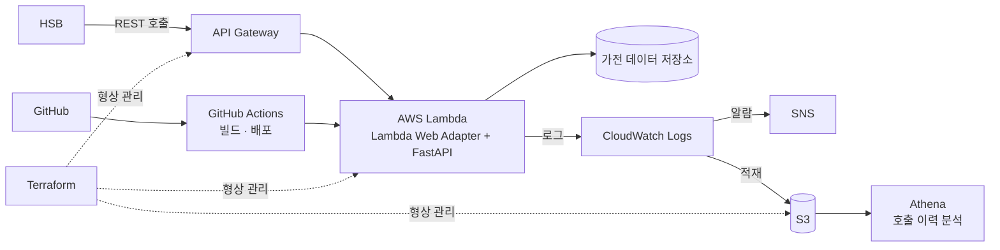

# 재보험사 연계 가전 데이터 제공 시스템 구축

> 재보험사 HSB에 자사 가전제품 관련 데이터를 제공하는 B2B REST API를 서버리스 아키텍처로 구축했다. 상시 트래픽이 아닌 외부 파트너 연동 워크로드의 특성을 고려해 쿠버네티스가 아닌 Lambda 기반으로 설계했다.

| 항목 | 내용 |
|---|---|
| 제공 대상 | 재보험사 HSB |
| 제공 내용 | REST API 호출 시 사용자 가전제품 관련 정보 반환 |
| 환경 | dev · stg · prd 3개 환경 |
| 역할 | 인프라 설계 및 구축, API 개발, 배포 파이프라인, 운영 |
| 기간 | **[확인 필요]** |

---

## 1. 배경과 문제 정의

재보험사는 가전제품의 상태·사용 이력 데이터를 인수 심사와 리스크 평가에 활용한다. 이에 자사 가전 데이터를 외부 파트너가 조회할 수 있는 연동 창구를 만드는 것이 과제였다.

설계 시 고려한 제약은 다음과 같다.

- **호출 패턴이 상시 트래픽이 아니다.** 외부 파트너의 조회 시점에 종속되므로, 유휴 시간에도 컴퓨팅 자원을 상시 점유하는 구조는 비효율적이다.
- **외부 조직에 데이터를 제공한다.** 사내 서비스와 달리 인증·인가, 제공 범위 통제, 호출 이력 추적이 필수적이다.
- **초기 연동 단계로 요구사항 변경이 잦다.** 스키마와 응답 형태가 확정되지 않은 상태에서 반복적인 배포와 검증이 필요했다.

> **[작성 필요]** 실제 제공한 데이터의 종류와 가공 수준을 명시할 것. 원천 데이터를 어디서 가져오는지, 집계·가공 단계가 있는지, 개인정보 비식별화를 어떻게 처리했는지 — 외부 제공 데이터인 만큼 이 항목이 있으면 프로젝트의 무게가 크게 달라짐.

---

## 2. 아키텍처

> **[확인 필요]** API Gateway 사용 여부와 데이터 원천 저장소를 실제 구성에 맞게 수정할 것. Lambda Function URL을 직접 노출했다면 그렇게 표기.

---

## 3. 기술 선택과 근거

### 왜 서버리스인가

쿠버네티스 기반 플랫폼을 직접 구축·운영해온 입장에서도, 이 워크로드에는 Lambda가 적합하다고 판단했다.

| 후보 | 판단 |
|---|---|
| EKS / ECS | 상시 기동 자원이 필요하나 호출이 간헐적이라 유휴 비용이 발생. 단일 API를 위해 클러스터 운영 부담을 추가하는 것은 과설계 |
| AWS Lambda | 채택. 호출 단위 과금으로 유휴 비용이 없고, 인프라 운영 부담 없이 배포 주기를 짧게 가져갈 수 있음 |

> **[작성 필요]** Lambda를 택하면서 감수한 제약과 그 대응. 콜드 스타트 지연을 어떻게 다뤘는지(Provisioned Concurrency 여부, 허용 가능한 수준으로 판단했는지), 15분 실행 제한이나 페이로드 크기 제한이 문제가 됐는지. 장점만 적힌 선택은 검토가 얕아 보임.

### Lambda Web Adapter + FastAPI

FastAPI로 API를 구현하고, Lambda Web Adapter를 통해 Lambda 런타임에 올렸다.

Web Adapter는 Lambda 이벤트를 표준 HTTP 요청으로 변환해 컨테이너 내부의 웹 서버에 전달한다. 따라서 **애플리케이션 코드가 Lambda 실행 환경에 종속되지 않는다.** 일반적인 ASGI 애플리케이션 그대로 로컬에서 실행·테스트할 수 있고, 향후 트래픽 성격이 바뀌어 컨테이너 기반으로 이전하더라도 코드 변경 없이 옮길 수 있다.

> **[확인 필요]** 위 서술이 실제 선택 이유와 일치하는지 확인. Mangum 등 다른 어댑터를 검토했다면 비교 근거를 한 줄 추가.

### 형상 관리 및 배포

| 도구 | 역할 |
|---|---|
| Terraform | dev · stg · prd 환경별 AWS 리소스 형상 관리 |
| GitHub Actions | 코드 변경 시 이미지 빌드 및 Lambda 배포 |

환경별 차이를 변수로 분리해 동일한 코드로 3개 환경을 관리했고, 배포 경로를 GitHub Actions로 일원화해 콘솔 수동 조작을 배제했다.

> **[작성 필요]** 외부 파트너 대상 API인 만큼 인증·인가 구조를 명시할 것. API Key인지 IAM 기반인지, 호출 쿼터나 Rate Limit을 뒀는지, 제공 범위를 어떻게 통제했는지.

### 운영 관측

두 개 층으로 분리했다.

- **실시간 감시** — CloudWatch Logs와 메트릭에 알람을 걸고, SNS로 담당자에게 통지한다.
- **호출 이력 분석** — CloudWatch Logs를 S3에 적재하고 Athena로 조회한다. 파트너별 호출량과 응답 패턴을 SQL로 분석할 수 있어, 로그 검색 도구로는 다루기 어려운 기간 단위 집계에 활용했다.

외부 제공 API는 장애 감지뿐 아니라 **누가 언제 무엇을 조회했는지에 대한 추적**이 함께 필요하다. 실시간 알람과 사후 분석의 목적이 다르므로 저장소와 조회 수단을 분리했다.

> **[작성 필요]** 어떤 조건에 알람을 걸었는지 구체적으로(에러율, 응답 지연, 호출량 급증 등). Athena 조회를 정기 리포트로 자동화했다면 그 구성도 함께.

---

## 4. 트러블슈팅

> **[작성 필요]** 운영 중 겪은 문제 1~2건. 증상 → 원인 파악 → 조치 → 재발 방지 순으로 서술. 콜드 스타트, 동시성 제한, 외부 연동 과정의 스키마 불일치 등 실제 겪은 사례.

---

## 5. 회고

> **[작성 필요]** 지금 다시 설계한다면. 데이터 제공 방식(실시간 API vs 배치 전달)의 재검토, 데이터 가공 파이프라인의 분리 여부 등.

---

## 사용 기술

`AWS Lambda` `Lambda Web Adapter` `FastAPI` `Terraform` `GitHub Actions` `CloudWatch` `SNS` `S3` `Athena`