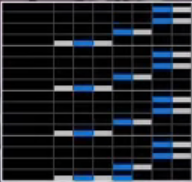

# 개천 획득의 회고록

SP 9단 상태에서 약 15개월간의 연습을 진행하여, 8월 30일자로 SP 개전 취득에 성공하였습니다. 
여기서는 SparkleShower에서의 개전 곡들을 하나씩 살펴보고 어떤 식으로 접근했는지 간단히 남겨보려 합니다. 

## 0. 언제 도전해야 하는가?

개인적으로는 아래 조건 중 2개 이상에 해당하면 도전할 만 하다고 봅니다.

- 배멘퀠천해를 전부 하드클리어한 경우. 정배가 아니어도 상관 없습니다. 배멘퀠천해는 다음과 같습니다.
    - Bad Maniacs
    - MENDES
    - quell -the seventh slave-
    - 天空の夜明け
    - HAERETICUS
- 하드게이지 서열표 기준 지력 S를 클리어한 경우
    - 저는 Almagest, Ignis†Iræ, 共鳴遊戯の華를 클리어했습니다.
- 하드게이지 서열표 기준 지력 A+ 을 10곡 이상 클리어
    - 저는 현재 배멘퀠천해 포함 약 18곡을 클리어했습니다.

지력 서열표는 [여기](https://namu.wiki/w/beatmania%20IIDX/%EB%B9%84%EA%B3%B5%EC%8B%9D%20%EB%82%9C%EC%9D%B4%EB%8F%84%ED%91%9C(%EC%8B%B1%EA%B8%80%20%EB%A0%88%EB%B2%A8%2012))를 확인하세요.

## 1. Somnidiscotheque

<iframe width="560" height="315" src="https://www.youtube.com/embed/Tj_WFVWl2ck?si=SH3RqXX_izJrsOu8" title="YouTube video player" frameborder="0" allow="accelerometer; autoplay; clipboard-write; encrypted-media; gyroscope; picture-in-picture; web-share" referrerpolicy="strict-origin-when-cross-origin" allowfullscreen></iframe>

개전의 난이도를 한 단계 업그레이드시킨 주범입니다. 
의미를 알 수 없는 스크래치와 노트들이 자주 등장하며, 곳곳에 있는 발광구간의 순간 밀도가 무시무시한 곡입니다. 

최후반 발광까지는 그래도 피를 채울 수 있는 구간이 곳곳에 있습니다. 50번째 마디 전까지는 체력 90% 이상정도는 되어야 마지막 발광 구간을 넘길 수 있다고 생각합니다.

최후반 발광은 아직도 어떤 식으로 쳐야하는지 모르겠습니다. 대충 눈에 보이는대로 치고, 발광이 잦아드는 마지막 마디에서 피를 최대한 채우려고 노력했습니다.

곡이 끝난 후 체력이 적어도 20%-30%은 남아야 개전 합격의 가능성이 있다고 생각합니다.
첫 번째 곡도 못넘긴다면 하드게이지 기준 지력 A~A+을 연습하면서 처리력을 더 기르도록 합시다.

## 2. 灼熱Beach Side Bunny

<iframe width="560" height="315" src="https://www.youtube.com/embed/ds5yufD5-6E?si=vDodRDP4fVKWPaHx" title="YouTube video player" frameborder="0" allow="accelerometer; autoplay; clipboard-write; encrypted-media; gyroscope; picture-in-picture; web-share" referrerpolicy="strict-origin-when-cross-origin" allowfullscreen></iframe>

스크곡의 대표주자 작열입니다.
저는 10단 즈음부터 1048식 -> 손목스크 로 플레이스타일을 바꿨는데요. 작열 관련해서 손목도 써보고 1048식도 써 본 결과 그냥 손목이 더 잘 되었습니다. 

스크래치는 보면서 치는 것보다 박자를 외우고 외운 박자대로 돌리는 것이 좋은 것 같습니다.
스크는 기억나는 박자대로 돌리고, 건반부를 확실히 PGREAT로 처리하겠다는 마음으로 임했습니다.

박자는 다음과 같은 공략 동영상을 참고했습니다.

<iframe width="560" height="315" src="https://www.youtube.com/embed/A9X2vwGvNXA?si=_-_eXTaaTWTZmPaa" title="YouTube video player" frameborder="0" allow="accelerometer; autoplay; clipboard-write; encrypted-media; gyroscope; picture-in-picture; web-share" referrerpolicy="strict-origin-when-cross-origin" allowfullscreen></iframe>

여기서 죽지만 않는다면, 다음 곡 히미코에서 체력을 채울 수 있으니 최대한 버텨봅시다. 

## 3. 卑弥呼

<iframe width="560" height="315" src="https://www.youtube.com/embed/RWuSGgZbcmU?si=0tLnfpj5kebJSEu-" title="YouTube video player" frameborder="0" allow="accelerometer; autoplay; clipboard-write; encrypted-media; gyroscope; picture-in-picture; web-share" referrerpolicy="strict-origin-when-cross-origin" allowfullscreen></iframe>

개인적으로 제일 편했던 곡입니다. 그나마 정직하게 처리력을 시험하는 패턴이라 생각합니다.

준비하고 있지 않으면 체력이 확 빠지는 부분이 몇 곳 있는데요. 아래 부분은 어느 정도 마음의 준비를 하고 연습을 하였습니다.

- 7 번째 마디의 1-5 트릴. 24비트라 빠르게 연타해야합니다.
- 24 번째 - 27 번째 마디의 5-7 트릴 박자가 은근 어려워서 외웠습니다.
- 31 번째 마디 / 33-36 마디의 동시치기 연타. 
- 71 - 72 번째 마디의 5-7 트릴. 역시 24비트입니다.
- 후반부 겹계단

변속이 총 3번 있으며 (185 -> 83 -> 185 -> 83), 저의 경우에는 플로팅을 사용하였습니다.
저속으로 대응하는 것보단 그냥 플로팅을 해서 체력을 최대한 채우는게 좋다는 생각입니다.

88번 마디 이후부터 이어지는 저속에서 최대한 체력을 채워봅시다. 저는 40%을 넘기는 것을 목표로 했습니다.

## 4. 冥

<iframe width="560" height="315" src="https://www.youtube.com/embed/AKvMlKP563U?si=T0Kw8Ulfg3rXxOqV" title="YouTube video player" frameborder="0" allow="accelerometer; autoplay; clipboard-write; encrypted-media; gyroscope; picture-in-picture; web-share" referrerpolicy="strict-origin-when-cross-origin" allowfullscreen></iframe>

이제부터 진짜 시작입니다. 저도 冥에서만 한 5번 죽었습니다 ㅎㅎ.

저속 돌입 구간까지 최대한 체력을 채워봅시다. 이 부분도 쉬운 구간은 아닙니다만(게다가 팔과 손가락이 매운 힘든 상태이니까요), 개인적으로는 이 부분에서 체력을 70%는 채워야한다고 안전하다고 봅니다.  

저속 돌입구간인 51번째 마디부터 본격적으로 2-3 연타가 시작되는 55번째 마디까지는 조금만 연습하면 놓치지 않을 수 있습니다. 스텝업 모드에서 개전 연습모드로 冥을 연습해보세요. 저는 동시치기 구간이라고 생각하면서 오른손을 기준으로 왼손 박자를 맞춰나갔습니다.

55 번째 마디 - 60 번째 마디 에서도 오른손을 기준으로 박자를 익히고 왼손 연타를 진행했습니다. (5번 건반 누르는 때 == 3번 건반을 누르는 때) 라는 감각으로 왼손을 처리했습니다.

본격적으로 발광이 시작되는 61번째 구간에서는 오히려 오른쪽 건반에 더 힘을 줬습니다. 왼쪽 구간은 정박으로 스크를 돌리고 1-3 트릴로 뭉개면서 4567 건반을 최대한 다 맞추겠다는 전략입니다.

65번째 계단 발광은 아래처럼 뭉개기 처리를 하였습니다. 이 부분도 스텝업에서 연습해보시길 바랍니다.

이 구간까지 넘긴다면 위닝런입니다. 따닥이 등이 나오지만 대충 치면 됩니다.

위에서도 말씀드렸지만, 개전을 도전하기 전에 스텝업 에서 단위인정 연습모드를 통해 冥을 5-10번 정도 연습해보는걸 추천합니다.
VEFX + Effect 버튼을 누르면 초기 체력도 설정할 수 있습니다. 저는 초기체력을 30%로 두고, 약 5번정도 클리어하며 감을 잡은 후 개전에 도전하였습니다.

그러면 여러분의 개전 합격을 응원합니다.

[:material-arrow-left: IIDX 페이지로 돌아가기](../rhythm.md)
